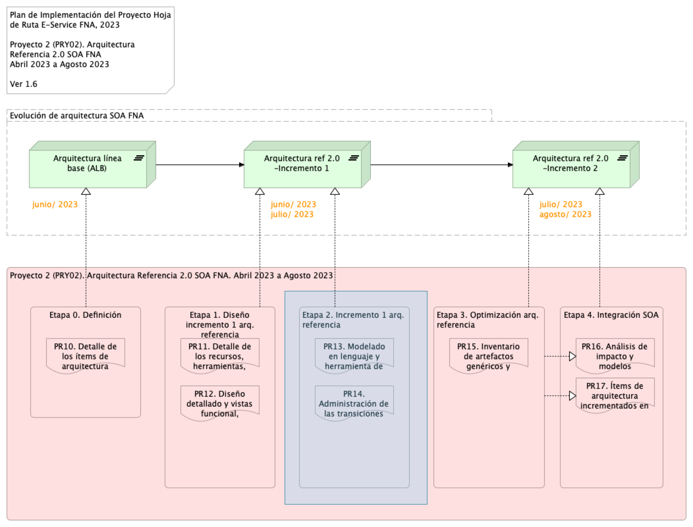

\newpage

>    E-Service. Fase II
> 
>    $PROYECTO. $PROY_DESCR. Contenido de los Productos Contractuales
> 
>    Contrato 1812020
> 
>    FNA, Stefanini
> 
>    $FECHA_COMPILACION
>
>    **Versión** 1.$COMMIT

 

# Producto 10: PR10. $PR10_NOMBRE
Lista de las partes de la arquitectura actual del FNA relacionados con el diseño de la arquitectura de referencia SOA 2.0, objeto del proyecto.

**Nota**: el resultado de este producto está dirigido a cumplir los objetivos del proyecto $PROYECTO. $PROY_DESCR: desarrollo, sostenibilidad (gestión) de arquitectura de referencia.

 

## Justificación
Adelantar la aprobación por parte del Fondo Nacional del Ahorro de los contenidos de los entregables del proyecto $PROYECTO, en su  Etapa 0, de la Hoja de Ruta E-Service, tal que garantice su continuidad y ejecución.

## Contenidos
1. Vista de segmento de la empresa, campo de acción del proyecto $PROYECTO
1. Justificación del segmento de la empresa requerido por el trabajo de arquitectura SOA de referencia 2.0
1. Iniciativas y brechas sensibles al trabajo de arquitectura de referencia 2.0 (relación con E-Service, Fase I)

 

## Criterios de Aceptación
* Lista de los ítems de arquitectura y brechas críticas del trabajo atendidos por la arquitectura de referencia SOA 2.0 del FNA
* Descripción de los ítems del segmento de la empresa del proyecto 2 ($PROYECTO), $PROY_DESCR

 

## Modelo de Implementación del $PROYECTO
{#fig: width=lin}

_Fuente: Elaboración propia._

 

