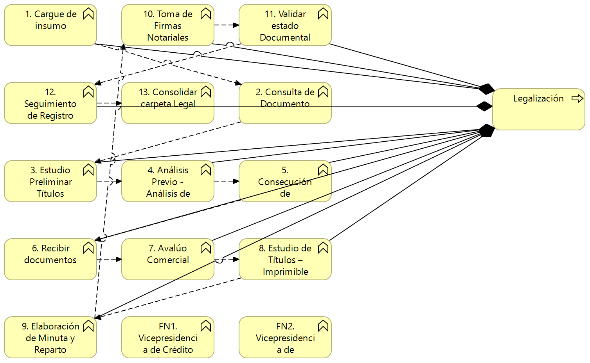

## Areas de Negocio FNA
En los modelos analizados (Anexo 2) no se evidencia relación de las áreas de negocio del FNA con otros elementos de la vista de segmento. Los modelos actuales no registran la relación de las áreas con los procesos de negocio (misionales, estratégicos o de soporte, ni con los seleccionados para el diagnóstico), aplicaciones ni con servicios SOA. 

**Importante**: si falta esta relación en los modelos, no hay forma de conocer ni gestionar la demanda de los servicios SOA del Fondo, y si estos responde a necesidades de negocio, o de operación, o de tecnología, o de alguna otra área o proceso.

La única relación encontrada es la de algunas áreas de negocio del FNA con el proceso de Legalización.

{#fig: width=}

_Fuente: ae_fna.archimate, ae_fna_as_is.archimate, ae_fna_tobe.archimate._

 

Las áreas de negocio que sí están modeladas (Anexo 1) no son representativas. Razón por la cual no tienen relación con los elementos relevantes de la empresa ni de este diagnóstico. 

### Anexo 1. Áreas FNA Modeladas
| Name                                                 | Type              |
|------------------------------------------------------|-------------------|
| 1\. Cargue de insumo                                 | business-function |
| 10\. Toma de Firmas Notariales                       | business-function |
| 11\. Validar estado Documental para Desembolso       | business-function |
| 12\. Seguimiento de Registro                         | business-function |
| 13\. Consolidar carpeta Legal                        | business-function |
| 2\. Consulta de Documento                            | business-function |
| 3\. Estudio Preliminar Títulos                       | business-function |
| 4\. Análisis Previo - Análisis de capacidad de pagos | business-function |
| 5\. Consecución de Documentos                        | business-function |
| 6\. Recibir documentos                               | business-function |
| 7\. Avalúo Comercial                                 | business-function |
| 8\. Estudio de Títulos – Imprimible                  | business-function |
| 9\. Elaboración de Minuta y Reparto Notarial         | business-function |
| Aplicacion de Negocio                                | business-function |
| Aplicacion de Negocio (copy)                         | business-function |
| Business Function                                    | business-function |
| FN1. Vicepresidencia de Crédito                      | business-function |
| FN2. Vicepresidencia de Operaciones.                 | business-function |
| Otras Áreas FNA                                      | business-function |
| Servicio de Negocio                                  | business-function |
| Servicio de Negocio (copy)                           | business-function |
| Versión Aplicación                                   | business-function |
| Versión Aplicación (copy)                            | business-function |
| Versiones Del Servicio                               | business-function |
| Versiones Del Servicio                               | business-function |

Table: Áreas de negocio de la Línea Base de Arquitectura (LBAF) del FNA analizadas. {#tbl:modelos1-id}

 

### Anexo 2. Modelos Analizados
* 2015-06-01 modelo arquitectura togaf - fna banca digital v6.archimate
* aa002 - cobis ahorro voluntario.archimate
* aa003-cobis cesantias.archimate
* aa005-cobis cartera.archimate
* aa006-cobis tramites.archimate
* aa015-cobis clientes.archimate
* aa020-banca virtual.archimate
* aa021-fondo en linea.archimate
* aa074-fondo en linea personal.archimate
* **aa091-cobis cx.archimate**
* **ae_fna.archimate**
* **ae_fna_as_is.archimate**
* ae_fna_tobe.archimate
* arquitectura banca digital v4.archimate
* **arquitectura fna.archimate**
* arquitectura movil_v1.archimate
* arquitectura movil_v2.archimate
* fna_proyectos v2.0.archimate
* information_architecture_bi_ba_md_archixml.archimate
* ivr.archimate
* pa0003-pki.archimate
* workmanager.archimate

Table: Modelos de la Línea Base de Arquitectura (LBAF) del FNA analizados. {#tbl:modelos2-id}

 
