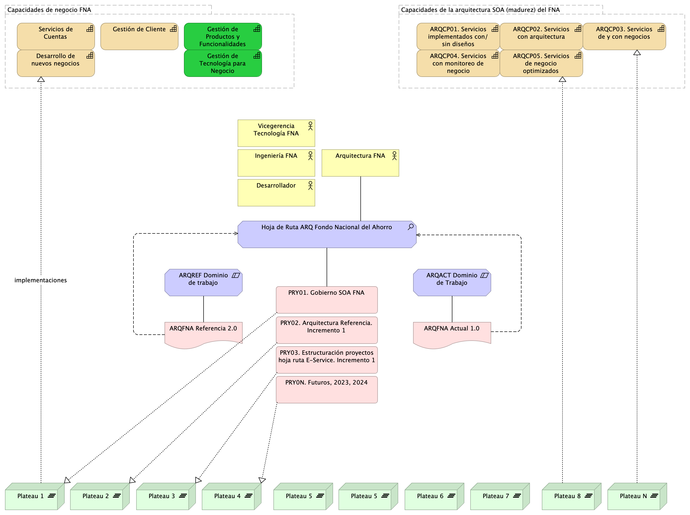

---
prnombre: "Administración de las transiciones hacia la arquitectura versión 2.0"
...

\newpage

| Tema           | $PR14_NOMBRE: **Relación de las transiciones con las capacidades de negocio y tecnología del FNA** |
|----------------|----------------------------------------------------------------------|
| Palabras clave | SOA, Arquitectura de referencia, Estadios de adopción, Adopción, Capacidades de arquitectura, Capacidades                    |
| Autor          |                                                              |
| Fuente         |                                                              |
| Versión        | **1.$COMMIT** del $FECHA_COMPILACION                       |
| Vínculos       | [Ejecución Plan de Trabajo SOA](onenote:#N001d.sharepoint.com); [Procesos de Negocio FNA](onenote:#N003a.com)|

 

Modelo Operativo SOA
1. Hoja de ruta
2. Actividades
3. Entregables
4. Implementación (fases de implementación)

{#fig: width=}

_Fuente: elaboración propia._

 
