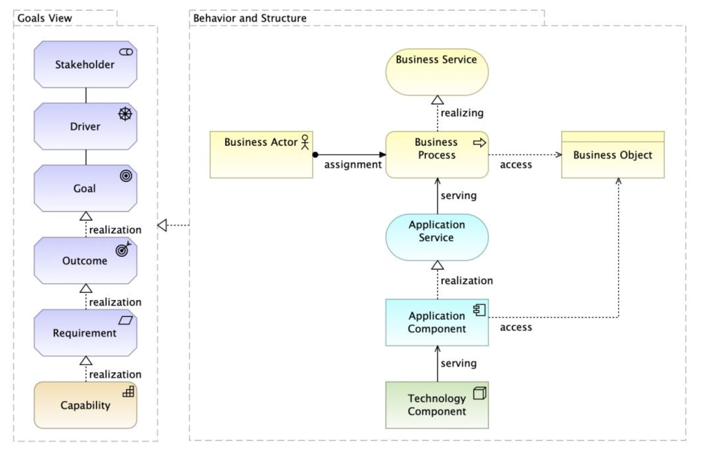

---
prnombre: "Inventario de artefactos genéricos y concretos de aceleración de implementación"
...

\newpage

| Tema           | $PR14_NOMBRE: **Listado de Bloques de Construcción Abstractos del FNA (BCAF)** |
|----------------|----------------------------------------------------------------------|
| Palabras clave | SOA, Arquitectura de referencia, Bloques de construcción, Genéricos, Reutilización, Tiempo de mercado                    |
| Autor          |                                                              |
| Fuente         |                                                              |
| Versión        | **1.$COMMIT** del $FECHA_COMPILACION                       |
| Vínculos       | [Ejecución Plan de Trabajo SOA](onenote:#N001d.sharepoint.com); [Procesos de Negocio FNA](onenote:#N003a.com)|

 

# Desarrolo de Bloques de Construcción Abstractos del FNA (BCAF)
## Modelamiento de los Bloques de Construcción Abstractos
En esta sección cubrimos patrones de modelamiento en Archimate y los patrones de diseño de los componentes genéricos que pueden usarse como procedimientos y fuentes de consulta al modelar conceptos y soluciones relacionadas con las arquitecturas, incluso las de referencia del Fondo Nacional.

Nota: ArchiMate es una notación completa, con una amplia gama de elementos y relaciones. Basta un subconjunto de elementos ArchiMate y solo un pequeño conjunto de tipos de diagrama son suficientes para la mayoría de los propósitos de modelado.

### Vista Tríptico Funcional: Negocio, Arquitectura, Tecnología
{#fig:123.png width=}

## Lista de Diseños de los Bloques de Construcción Abstractos (genéricos) del FNA 
Existen varios enfoques diferentes para acelerar la implementación de una arquitectura. En este ejercicio de arquitectura de referencia hemos propuesto el los bloques de construcción genéricos SOA, los cuales ayudan a seleccionar la solución adecuada para el contexto que la requiera. La solución de los bloques genéricos comportan una ventaja adicional, que no es menor, por lo que tienden a disminuir la densidad de errores en las implementaciones de arquitectura al partir de una construcción base, si bien abstracta, agiliza el inicio del proceso de construcción, que es precisamente la más propensa al error.

Presentamos a continuación la lista de bloques de construcción genéricos recomendados para agilizar la construcción de arquitecturas en el FNA.

1. Organización de inventario
   * Inventario empresarial
   * Normalización de servicios
   * Esquema canónico
   * Estratos de servicios
2. Gobierno de Servicios
   * Versionamiento
   * Reforma de servicio
   * Descomposición de servicios
3. Implementación de servicios
   * Fachadas
   * Redundancia
   * Replicación
   * Mediador UI
4. Seguridad
   * Confidencialidad
   * Autenticación de mensaje / datos
   * Autenticación directa
   * Mediación de autenticación 
5. Contratos
   * Contrato desacoplado
   * Contrato centralizado
6. Organización de servicios
   * Descomposición funcional
   * Encapsulamiento de servicio
   * Contexto agnóstico
7. Manejo de legados
   * Envoltura de legado
   * Punto multicanal
   * Compuerta de archivo
8. Manejo de capacidades
   * Composición de capacidades
   * Recomposición de capacidades
9. Mensajes de servicios
   * Mensajería entre servicios
   * Agentes
   * Interruteo
   * Mensajería con estado
   * Devolución de llamado (callback)
   * Encolado asíncrono
   * Mensajería confiable
   * Mensajería eventual
10. Diseño de composiciones
	* Orquestación
	* ESB
	* Intermediación
11. Implementación de composición
	* Controlador secundario (agnóstico)
	* Autonomía de la composición 
	* Transacción atómica
	* Compensación transaccional

 

Nota: la lista de bloques genéricos aquí presentados requieren de implementación, pero esta no hace parte del alcance del proyecto actual.

 
