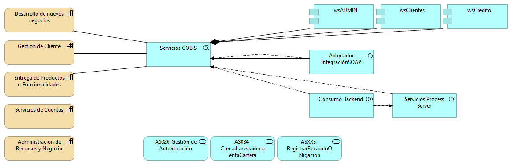
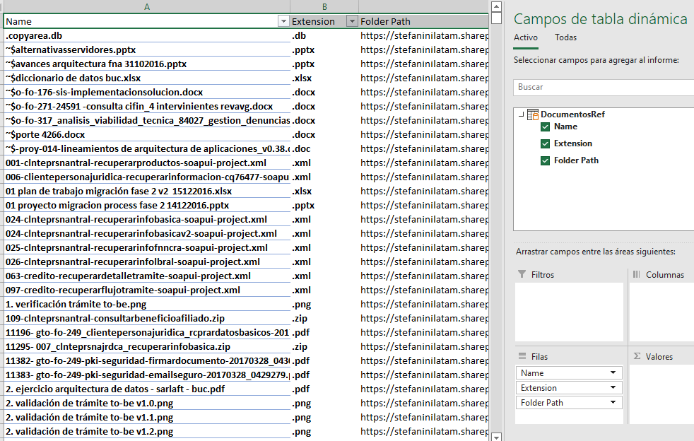
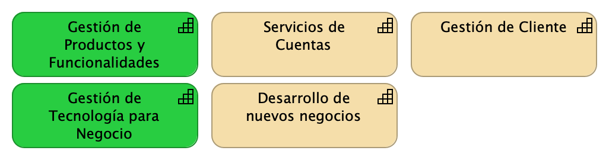
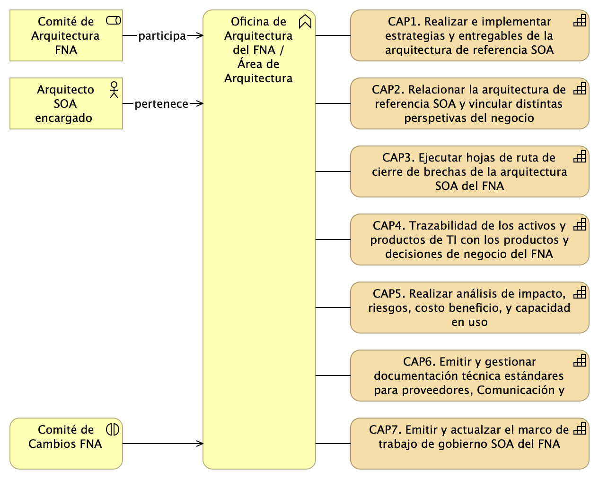
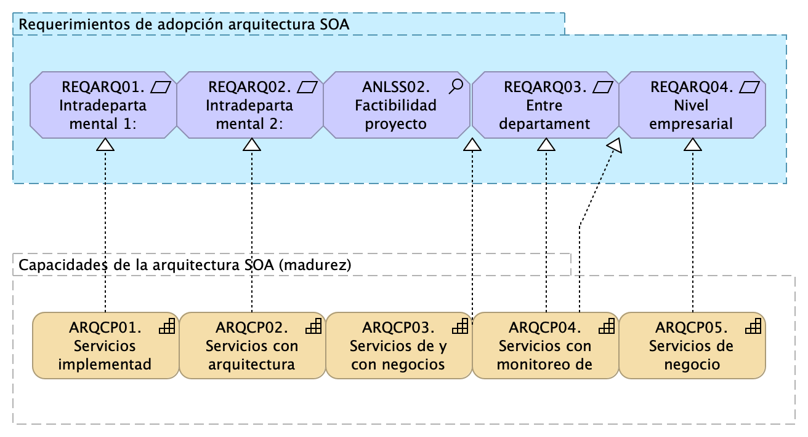
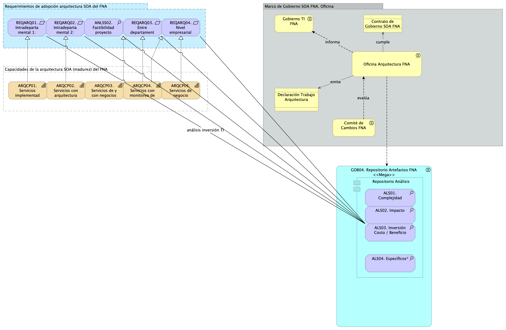
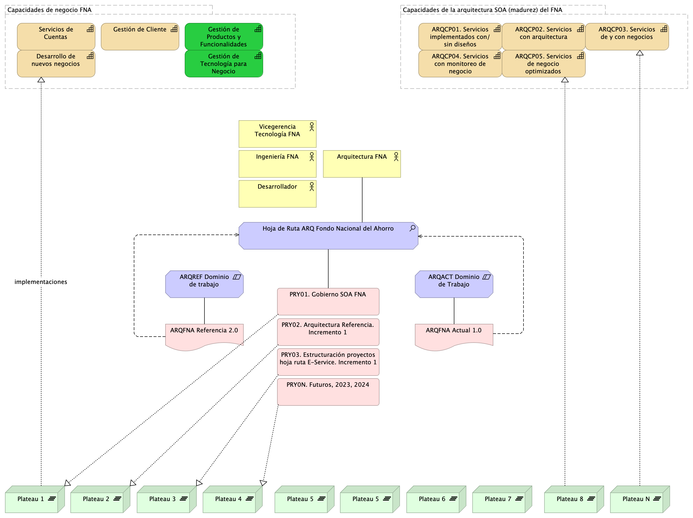

title: E-Service Etapa 2. Arquitectura de Referencia SOA 2.0 del FNA
geometry:
  - top=1in
  - bottom=1in
fignos-cleveref: True
fignos-plus-name: Fig.
fignos-caption-name: Imagen
tablenos-caption-name: Tabla
...

<small><em>Los productos de esta etapa ([Web](https://hwong23.github.io/fna-dd-f2-pry2-e3/v/fb3f9eaeb5537e8e9a925fb535daadd23e1294b7/))
están basados en el resultado de la consultoría "Arquitectura E-Service",
[Sharepoint STEF@fb3f9ea](https://stefaninilatam.sharepoint.com/:f:/r/sites/PROYECTOARQUITECTURAE-SERVICEFNA/Documentos%20compartidos/General/Repositorio%20SOA/Procesos%20Fase%20II/181-2020.%20E-SERV.%20Fase%202-ETAPA%200.%20docx?csf=1&web=1&e=BiNcBP)
del August 10, 2023.
</em></small>

|    **Versión** del producto 1.fb3f9ea de 10 Aug 2023

 

## Autores

+ **Harry Wong, ing.**
   
    · {.inline_icon width=16 height=16}
    [e_hwong](https://github.com/e_hwong)
     
  <small>
     Arquitecto SOA, Stefanini
  </small>

+ **Wilson Morales, ing.**
   
    · {.inline_icon width=16 height=16}
    [wmorales](https://github.com/wmorales)
     
  <small>
     Software, Aplicaciones
  </small>

+ **Sergio Andrés Castro Hernandez, ing.**
   
    · {.inline_icon width=16 height=16}
    [fhernandez](https://github.com/fhernandez)
     
  <small>
     SOA, Arquitectura
  </small>

+ **Viviana M. Martinez, ing.**
   
    · {.inline_icon width=16 height=16}
    [vmmartinez](https://github.com/vmmartinez)
     
  <small>
     Analista, Proyectos
  </small>

::: {#correspondence}
✉ — Enviar mensajes a Harry Wong, ing. \<e_hwong@stefanini.com\>.

:::

 

## Objetivo del Documento
Entrega de los productos de la Etapa 2, PR13. Modelado en lenguaje y herramienta de diseño del FNA​ y PR14. Administración de las transiciones hacia la arquitectura versión 2.0, del proyecto Arquitectura de Referencia SOA 2.0 del FNA, flujos de trabajo y personas que ejercitan y conforman (cumplen) con el gobierno SOA del FNA a desplegar a cargo de la oficina de arquitectura.

##  Control de Cambios {.page_break_before}
| Tema           | PRY02 Arquitectura de Referencia SOA 2.0 del FNA      |
|----------------|----------------------------|
| Palabras clave | SOA, E-Service, FNA, Análisis de brecha, GAP, Comparativa              |
| Autor          |                            |
| Fuente         |                            |
| Versión        | 1.fb3f9ea del 10 Aug 2023 |
| Vínculos       | [N003a Vista Segmento SOA FNA](N03a%a20Vsta%20aSegenta%20SOA%20FNA.md) |

 

 

## Contenidos
\toc

\newpage

>    E-Service. Fase II
>
>    PRY02. Arquitectura de Referencia SOA 2.0 del FNA. Contenido de los Productos Contractuales
>
>    Contrato 1812020
>
>    FNA, Stefanini
>
>    10 Aug 2023
>
>    **Versión** 1.fb3f9ea

 

# Producto 13: PR13. Modelado en lenguaje y herramienta de diseño del FNA​
El principal entregable de este producto son los modelos de arquitectura de referencia 2.0 del FNA. Para la mayoría de los casos, y en este contexto, los modelos refieren a conjuntos información de ingeniería (no se agotan en solo diagramas o documentos) relevante a los sistemas de información, servicios, componentes y herramientas de software del FNA representados con el lenguaje de descripción de arquitectura designado, que para el caso es Archimate 3.0. Nota: distintos modelos de igual importancia que la arquitectura del FNA pueden estar representados en otros lenguajes de componentes, procesos de negocio, rendimiento, redes de comunicaciones.

Otro entregable primario de este producto es la documentación técnica inicial con la que denotamos a las especificaciones de línea base de la arquitectura de referencia 2.0 del FNA. Siendo que esta información textual puede ser considerada como discreta y de que no puede ser verificada (distinta de los modelos), sigue teniendo la ventaja de que es fácil de comunicar.

Juntos, los modelos y las especificaciones y requerimientos de arquitectura, estos entregables constituyen lo que llamamos la Arquitectura de Referencia SOA 2.0 del FNA, y que además de ser una línea base, tiene la responsabilidad adicional de ser la hoja de ruta y, por tanto, guía de la transformación de las arquitectura estado actual hacia esta nueva versión.

**Nota**: los análisis de este producto están dirigidos a cumplir los objetivos del proyecto PRY01, Gobierno SOA: desarrollo, gestión, gobierno de arquitectura y adopción.

 

## Justificación
La representación de la información de ingeniería relevante a los sistemas de información, servicios, componentes y herramientas de software del FNA en elementos de un modelo de arquitecturas supone algunas ventajas frente a la información textual, y de cualquier otro tipo, y de ahí el mérito de estos. Una de estas ventajas es que los modelos pueden acopiar y _asociarse (mapear) con requerimientos de arquitectura mediante unidades de trabajo accionables como épicas, casos de uso, historias y escenarios_. Además, los modelos comportan la ventaja de que son verificables y de fácil transporte. Pero ninguna de estas razones es lo más importante. La verdadera justificación de tener modelado de esta arquitectura de referencia 2.0 (en un lenguaje de descripción de arquitectura) es que el FNA cuente con la creación de un entorno centrado en modelos, el cual, deja abierta la posibilidad de la aplicación de técnicas y creación de productos de ingeniería.

## Contenidos
1. Análisis de los elementos del modelo de la arquitectura de referencia SOA 2.0 del FNA
1. Repositorio de arquitectura del FNA actualizado con arquitectura de referencia
1. Documentación técnica 0.2 de la arquitectura de referencia SOA
1. Proceso de mantenimiento de la arquitectura de referencia SOA 2.0 del FNA

 

## Criterios de Aceptación
* Repositorio de arquitectura del FNA actualizado con arquitectura de referencia
* Entendimiento del proceso de mantenimiento de la arquitectura de referencia SOA 2.0 del FNA y sus implicaciones

 

## Repositorio de Arquitectura del FNA, versión 0.1
{#fig: width=}

_Fuente: Diagnóstico SOA. E-Service (2022)._

## Modelo de Implementación del PRY02
{#fig: width=}

_Fuente: Elaboración propia._

 

---
prnombre: "Modelado en lenguaje y herramienta de diseño del FNA​"
...

\newpage

| Tema           | Modelado en lenguaje y herramienta de diseño del FNA​: **Análisis de los elementos del modelo de la arquitectura de referencia SOA 2.0 del FNA** |
|----------------|----------------------------------------------------------------------|
| Palabras clave | SOA, Arquitectura de referencia, Flujo de trabajo                    |
| Autor          |                                                              |
| Fuente         |                                                              |
| Versión        | **1.fb3f9ea** del 10 Aug 2023                       |
| Vínculos       | [Ejecución Plan de Trabajo SOA](onenote:#N001d.sharepoint.com); [Procesos de Negocio FNA](onenote:#N003a.com)|

 

# Análisis de Elementos Relevantes para la Arquitectura de Referencia SOA 2.0 del FNA
## Catálogo de Servicios FNA (blueprint)

### Capacidades de la Empresa FNA
No hay capacidades de negocio FNA en los modelos de la empresa, pero en la documentación del repositorio hay información sustituta con la que hacemos una propuesta de la vista de las capacidades FNA. Esta vista preliminar sirve para relacionar las capacidades preliminares con los servicios SOA de la empresa y con los demás elementos de la vista de segmento.

Capacidades de negocio encontradas:

1. Desarrollo de nuevos negocios
1. Gestión de Cliente
1. Administración de Recursos y Negocio
1. Entrega de Productos
1. Servicios de Cuentas
1. Gestión Financiera

_Fuente: Portafolio de Aplicaciones FNA._

 

### Importancia de las Capacidades y Servicios SOA (y otras partes de la empresa)
La intersección de la vista de segmento del FNA con las capacidades de negocio propuestas por este ejercicio (en color naranja abajo) resultará en la lista de servicios de negocio más importantes para la empresa dado su nivel de relación con estas capacidades.

{#fig: width=}

 

Por lo anterior, los servicios SOA del FNA más relevantes según los modelos son los indicados a continuación. De igual manera que para el Fondo, estas partes de la empresa son importantes para futuros diagnósticos y gobierno SOA.

|**Parte FNA**|**Parte Relacionada**|**Tipo**|
|-------------|---------------------|--------|
|Desarrollo de nuevos negocios|AS026-Gestión de Autenticación|**application-service**|
||AS034-ConsultarestadocuentaCartera|**application-service**|
||ASXX3-RegistrarRecaudoObligacion|**application-service**|
||COBIS|application-component|
||Servicios COBIS|application-collaboration|
|Entrega de Productos|AS026-Gestión de Autenticación|**application-service**|
||AS034-ConsultarestadocuentaCartera|**application-service**|
||ASXX3-RegistrarRecaudoObligacion|**application-service**|
||COBIS|application-component|
||Servicios COBIS|application-collaboration|
|Gestión de Cliente|AS026-Gestión de Autenticación|**application-service**|
||AS034-ConsultarestadocuentaCartera|**application-service**|
||ASXX3-RegistrarRecaudoObligacion|**application-service**|
||COBIS|application-component|
||Servicios COBIS|application-collaboration|
|Servicios de Cuentas|AS026-Gestión de Autenticación|**application-service**|
||AS034-ConsultarestadocuentaCartera|**application-service**|
||ASXX3-RegistrarRecaudoObligacion|**application-service**|
||COBIS|application-component|

Table: Servicios SOA del FNA más relevantes según modelos FNA. {#tbl:capacidades-id}

_Fuente: arquitectura fna.archimate_

 

Las capacidades de mayor importancia para el FNA debido a su nivel superior de relación con las partes relevantes de la empresa son los siguientes

|Nombre Origen|**Destino**|**Relevancia**|
|-------------|-----------|--------------|
|Desarrollo de nuevos negocios|COBIS|**96**|
|Desarrollo de nuevos negocios|AS026-Gestión de Autenticación|8|
|Desarrollo de nuevos negocios|AS034-ConsultarestadocuentaCartera|6|
|Desarrollo de nuevos negocios|ASXX3-RegistrarRecaudoObligacion|5|
|Desarrollo de nuevos negocios|Servicios COBIS|13|
|**Total Desarrollo de nuevos negocios**||128|
|Entrega de Productos|COBIS|**96**|
|Entrega de Productos|AS026-Gestión de Autenticación|8|
|Entrega de Productos|AS034-ConsultarestadocuentaCartera|6|
|Entrega de Productos|ASXX3-RegistrarRecaudoObligacion|5|
|Entrega de Productos|Servicios COBIS|13|
|**Total Entrega de Productos**||128|
|Gestión de Cliente|COBIS|**96**|
|Gestión de Cliente|AS026-Gestión de Autenticación|8|
|Gestión de Cliente|AS034-ConsultarestadocuentaCartera|6|
|Gestión de Cliente|ASXX3-RegistrarRecaudoObligacion|5|
|Gestión de Cliente|Servicios COBIS|13|
|**Total Gestión de Cliente**||128|
|Servicios de Cuentas|COBIS|**96**|
|Servicios de Cuentas|AS026-Gestión de Autenticación|8|
|Servicios de Cuentas|AS034-ConsultarestadocuentaCartera|6|
|Servicios de Cuentas|ASXX3-RegistrarRecaudoObligacion|5|
|**Total Servicios de Cuentas**||115|

Table: Las capacidades de mayor importancia para el FNA. {#tbl:capacidades2-id}

_Fuente: arquitectura fna.archimate_

 

## Areas de Negocio FNA
En los modelos analizados (Anexo 2) no se evidencia relación de las áreas de negocio del FNA con otros elementos de la vista de segmento. Los modelos actuales no registran la relación de las áreas con los procesos de negocio (misionales, estratégicos o de soporte, ni con los seleccionados para el diagnóstico), aplicaciones ni con servicios SOA. 

**Importante**: si falta esta relación en los modelos, no hay forma de conocer ni gestionar la demanda de los servicios SOA del Fondo, y si estos responde a necesidades de negocio, o de operación, o de tecnología, o de alguna otra área o proceso.

La única relación encontrada es la de algunas áreas de negocio del FNA con el proceso de Legalización.

{#fig: width=}

_Fuente: ae_fna.archimate, ae_fna_as_is.archimate, ae_fna_tobe.archimate._

 

Las áreas de negocio que sí están modeladas (Anexo 1) no son representativas. Razón por la cual no tienen relación con los elementos relevantes de la empresa ni de este diagnóstico. 

### Anexo 1. Áreas FNA Modeladas
| Name                                                 | Type              |
|------------------------------------------------------|-------------------|
| 1\. Cargue de insumo                                 | business-function |
| 10\. Toma de Firmas Notariales                       | business-function |
| 11\. Validar estado Documental para Desembolso       | business-function |
| 12\. Seguimiento de Registro                         | business-function |
| 13\. Consolidar carpeta Legal                        | business-function |
| 2\. Consulta de Documento                            | business-function |
| 3\. Estudio Preliminar Títulos                       | business-function |
| 4\. Análisis Previo - Análisis de capacidad de pagos | business-function |
| 5\. Consecución de Documentos                        | business-function |
| 6\. Recibir documentos                               | business-function |
| 7\. Avalúo Comercial                                 | business-function |
| 8\. Estudio de Títulos – Imprimible                  | business-function |
| 9\. Elaboración de Minuta y Reparto Notarial         | business-function |
| Aplicacion de Negocio                                | business-function |
| Aplicacion de Negocio (copy)                         | business-function |
| Business Function                                    | business-function |
| FN1. Vicepresidencia de Crédito                      | business-function |
| FN2. Vicepresidencia de Operaciones.                 | business-function |
| Otras Áreas FNA                                      | business-function |
| Servicio de Negocio                                  | business-function |
| Servicio de Negocio (copy)                           | business-function |
| Versión Aplicación                                   | business-function |
| Versión Aplicación (copy)                            | business-function |
| Versiones Del Servicio                               | business-function |
| Versiones Del Servicio                               | business-function |

Table: Áreas de negocio de la Línea Base de Arquitectura (LBAF) del FNA analizadas. {#tbl:modelos1-id}

 

### Anexo 2. Modelos Analizados
* 2015-06-01 modelo arquitectura togaf - fna banca digital v6.archimate
* aa002 - cobis ahorro voluntario.archimate
* aa003-cobis cesantias.archimate
* aa005-cobis cartera.archimate
* aa006-cobis tramites.archimate
* aa015-cobis clientes.archimate
* aa020-banca virtual.archimate
* aa021-fondo en linea.archimate
* aa074-fondo en linea personal.archimate
* **aa091-cobis cx.archimate**
* **ae_fna.archimate**
* **ae_fna_as_is.archimate**
* ae_fna_tobe.archimate
* arquitectura banca digital v4.archimate
* **arquitectura fna.archimate**
* arquitectura movil_v1.archimate
* arquitectura movil_v2.archimate
* fna_proyectos v2.0.archimate
* information_architecture_bi_ba_md_archixml.archimate
* ivr.archimate
* pa0003-pki.archimate
* workmanager.archimate

Table: Modelos de la Línea Base de Arquitectura (LBAF) del FNA analizados. {#tbl:modelos2-id}

 

## Análisis de Alineación con Negocio FNA
El nivel de alineación tecnología-negocio lo evidenciamos en dos vías. La primera, mediante la relación de las capacidades de negocio con los servicios SOA. La segunda, por medio de la distribución de población de servicios en el portafolio del FNA, esto es, la cuenta de servicios por tipo.

### Alineación Mediante la Relación Capacidades-Servicios SOA
Para conseguir la alineación definitiva de negocio del FNA, de las áreas seleccionadas por este ejercicio, y de los requerimientos funcionales y de mejora con los servicios SOA _es imperativo desarrollar el modelo de capacidades de negocio del FNA_. Desarrollar formalmente el modelo de capacidades, y profundizar en sus relaciones con las demás partes de la empresa, que incluye a los servicios SOA, hace posible el enfocar los esfuerzos, los análisis, asignar recursos y aplicar controles exclusivos en aquellas partes más cercanas a estas capacidades, y que por ende son las tienden a liberan el mayor valor e impacto positivo para el Fondo. Lo contrario a esto sería desarrollar todo basado en la percepción: desarrollar todo lo que sea percibido en su momento como importante, y después cambiar de objetivo cuando surja uno que tenga mejor percepción.

Desarrollar las capacidades de negocio del FNA beneficia también al desarrollo y selección de las tecnologías del FNA; particularmente a la arquitectura SOA que es objeto de este diagnóstico. Una vez el cuente con las capacidades de negocio tanto de la vicepresidencia de Crédito como con la de Operaciones es fácil gestionar las capacidades y los requerimientos de los servicios SOA, y describir con ello más detalles de una posibilidad de la arquitectura de referencia que sirva como hoja de ruta para seguir mejorando la empresa.

La imagen siguiente muestra que en el estado actual SOA de la empresa son muy pocas las relaciones entre las capacidades de negocio y los servicios SOA del Fondo, razón por la que es necesario que el FNA desarrolle su modelo de capacidades de negocio, y gestione mejor los requerimientos de negocio con el desarrollo de tipos de servicios de negocio.

{#fig: width=}

_Fuente: elaboración propia_.

 

>**Nota**. La situación actual SOA evidencia que la alineación con negocio pasa más por las aplicaciones y herramientas de software que por los servicios (ver [N003e. Catálogo de Servicios FNA-1](N003e.md)). Es imperativo desarrollar el modelo de capacidades de negocio del FNA, tal que permita enfocar los esfuerzos de monitoreo de negocio y de gobierno de servicios SOA.

 

### Alineación Mediante Clasificación del Portafolio de Servicios SOA del FNA
El otro indicio de alineación SOA con el negocio viene esta vez de mano del portafolio de servicios del Fondo. _Viendo la tabla de la distribución actual de los servicios del portafolio sobresale que se encuentra inclinada hacia los servicios de información_. Esto puede significar que las necesidades de negocio de las vicepresidencias de Crédito y de Operaciones están siendo satisfechas en mayor grado por este tipo de servicios, que con servicios de negocio o de proceso.

|                      |              |
|----------------------|:------------:|
| **Tipo Servicio**    | **Cantidad** |
| Servicio Información |    **55**    |
| Servicio Proceso     |      18      |
| Servicio Negocio     |      14      |
| **Total general**    |    **87**    |

Table: Catalogación de los tipos de servicios SOA de la Línea Base de Arquitectura (LBAF) del FNA analizada. {#tbl:alienacion-id}

_Fuente: elaboración propia, [N003e. Catálogo de Servicios FNA-3](N003e.CatálogodeServiciosFNA-3.md)_

 

_Información adicional_. Los servicios de negocio son los que elaboran una respuesta mediante un cómputo (sea cálculo, diferencia, comparación), y por tanto, inciden en la flexibilidad de negocio. Son los de menor presencia en el portafolio FNA. En cambio, los servicios de procesos son aquellos que orquestan la ejecución de las tareas de los procesos de negocio (BPM).

 

>**Nota**. Los requerimientos de servicios de las áreas vicepresidencias de Crédito y de Operaciones son en mayoría de transporte, integración y consulta de datos cuando la flexibilidad de negocio está más basada en los servicios de proceso y de negocio.

---
prnombre: "Modelado en lenguaje y herramienta de diseño del FNA​"
...

\newpage

| Tema           | Modelado en lenguaje y herramienta de diseño del FNA​: **Repositorio de arquitectura del FNA actualizado con arquitectura de referencia** |
|----------------|----------------------------------------------------------------------|
| Palabras clave | SOA, Arquitectura de referencia, Flujo de trabajo                    |
| Autor          |                                                              |
| Fuente         |                                                              |
| Versión        | **1.fb3f9ea** del 10 Aug 2023                       |
| Vínculos       | [Ejecución Plan de Trabajo SOA](onenote:#N001d.sharepoint.com); [Procesos de Negocio FNA](onenote:#N003a.com)|

 

# Repositorio de Arquitectura del FNA Actualizado con Arquitectura de referencia Inicial
Existe la oportunidad de impulsar la evolución de la alineación de la tecnología con las áreas misionales del Fondo dado que el repositorio de arquitectura del FNA contiene información inicial para este objetivo (ver la tabla siguiente, clasificación de información del repositorio del Fondo). 

| **Contenidos FNA**                 |          |
|------------------------------------|----------|
| Servicios                          | **543**  |
| Arquitectura                       | 352      |
| Información                        | 248      |
| Aplicación                         | 107      |
| Funcional                          | 61       |
| **Total Contenidos FNA revisados** | **1311** |

Table: Clasificación de información del repositorio del FNA. {#tbl:contenidos-id}

_Fuente: elaboración propia._

 

Sin embargo, antes de dar paso a la gestión de la tecnología para el negocio de FNA hay que subsanar estas problemática encontradas en la información de los modelos y conceptos del repositorio:

1. Redundancias y el atraso de la información de los modelos y conceptos. 
1. Incompletitud en el modelamiento de conceptos, como las capacidades de negocio, o los procesos de negocio del FNA.
1. Inconsistencia en el lenguaje de modelado. Falta estandarizar nombres y formas de representación de los mismo conceptos entre modelos.

 

Para apoyar la gestión de la alineación de la tecnología del Fondo guíada por la arquitectura, hemos creado una herramienta de búsqueda, navegación y clasificación de los contenidos del repositorio del FNA

{#fig:libreria.png width=}

_Fuente: elaboración propia._

## Anexo 2. Modelos Actualizados
Modelos actualizados por el ejercicio actual y por tanto, entregados al FNA, producto PR06.

Estos modelos se encuentran por ahora, mientras dura el proyecto en repositorio intermedio de entregas [Repositorio SOA](https://stefaninilatam.sharepoint.com/:f:/r/sites/PROYECTOARQUITECTURAE-SERVICEFNA/Documentos%20compartidos/General/Repositorio%20SOA/Modelos?csf=1&web=1&e=LSEm4L).

* 2015-06-01 modelo arquitectura togaf - fna banca digital v6.archimate
* aa002 - cobis ahorro voluntario.archimate
* aa003-cobis cesantias.archimate
* aa005-cobis cartera.archimate
* aa006-cobis tramites.archimate
* aa015-cobis clientes.archimate
* aa020-banca virtual.archimate
* aa021-fondo en linea.archimate
* aa074-fondo en linea personal.archimate
* **aa091-cobis cx.archimate**
* **ae_fna.archimate**
* **ae_fna_as_is.archimate**
* ae_fna_tobe.archimate
* arquitectura banca digital v4.archimate
* **arquitectura fna.archimate**
* arquitectura movil_v1.archimate
* arquitectura movil_v2.archimate
* fna_proyectos v2.0.archimate
* information_architecture_bi_ba_md_archixml.archimate
* ivr.archimate
* pa0003-pki.archimate
* workmanager.archimate

 

---
pr14nombre: "Administración de las transiciones hacia la arquitectura versión 2.0"
...

\newpage

>    E-Service. Fase II
>
>    PRY02. Arquitectura de Referencia SOA 2.0 del FNA. Contenido de los Productos Contractuales
>
>    Contrato 1812020
>
>    FNA, Stefanini
>
>    10 Aug 2023
>
>    **Versión** 1.fb3f9ea

 

# Producto 14: PR14. Administración de las transiciones hacia la arquitectura versión 2.0
Las arquitecturas de referencia, en el contexto del ejercicio de este proyecto, tienen el rol de servir de mapa de viaje contra el cual comparar el recurrido de un cambio objetivo. El arribo a otro estadio de las cosas es lo que llamamos formalmente como Plateu, en Archimate 3.0, para denotar un estado estable de del funcionamiento de los componentes de una arquitectura transaccionada por efecto de las operaciones de trabajo que se han realizado sobre esta. Esta arquitectura afectada por el trabajo, que es distinta de las actualizaciones de los modelos (porque la supera en proporción e intención), y que ha llegado a un estado estable es lo que llamamos en este proyecto transición. Por ende, las arquitecturas intermedias que se den, o las transiciones, las denominamos arquitecturas de transición.

Sobre estas transacciones trataremos en este producto, PR14, Administración de las transiciones hacia la arquitectura versión 2.0. Consideraremos el contexto del Fondo Nacional, diagnósticos inclusive, para establecer una forma (métodos) en la que estos cambios deban ser realizados, las transiciones de las arquitecturas gestionadas y vigiladas, todo esto para finalmente llegar a tratar del cómo lograr la adopción dentro de estas transformaciones entre los actores e involucrados del FNA.

**Nota**: los análisis de este producto están dirigidos a cumplir los objetivos del proyecto PRY01, Gobierno SOA: desarrollo, gestión, gobierno de arquitectura y adopción.

 

## Justificación
Las arquitecturas de transición son el sujeto principal, causa, de la movilidad de un estado de las cosas a otro intencionadamente superior debido a las afectaciones a las capacidades que implican. La transición juega en paralelo con el concepto de uso y adopción del cambio de arquitectura, al que agregamos nosotros el valor del aprovechamiento de este movimiento de un estadio a otro. De ahí que, además de crear transiciones con los métodos propuestos, la gestión de estos entregables sobresale porque estas le apuntan a que los retornos se den según expectativas del cambio mientras mantiene el control de los riesgos (probabilidad de éxito) y administra los obstáculos. Gestionar transiciones de las arquitecturas en el FNA es en últimas garantizar que la arquitectura proveerá el resultado que persiguen los cambios sin comprometer su estabilidad (funcionamiento).

## Contenidos
1. Posibles estadios de adopción y madurez de las arquitecturas para el FNA
1. Relación de las transiciones con las capacidades de negocio y tecnología del FNA
1. Relación de las transiciones con la efectividad (madurez) de los servicios SOA del FNA
1. Métodos del FNA para la creación y gestión de arquitecturas de transición
1. Criterios y métodos de evaluación de arquitecturas de transición

 

## Criterios de Aceptación
* Entendimiento de los métodos, tanto de creación de transiciones, como de hoja de rutas para su aplicación en el FNA
* Entendimiento del relacionamiento de las capacidades del FNA y los índices de madurez SOA con las arquitecturas de transición
* Entendimiento del método para gestionar las arquitecturas de transición del FNA
* Entendimiento del rol de la Oficina de Arquitectura en la gestión de las arquitecturas de transición del FNA

 

## Modelo de Implementación del PRY02
{#fig: width=}

_Fuente: Elaboración propia._

 

---
prnombre: "Administración de las transiciones hacia la arquitectura versión 2.0"
...

\newpage

| Tema           | Administración de las transiciones hacia la arquitectura versión 2.0: **Posibles estadios de adopción y transición (madurez) de las arquitecturas para el FNA** |
|----------------|----------------------------------------------------------------------|
| Palabras clave | SOA, Arquitectura de referencia, Estadios, Adopción                    |
| Autor          |                                                              |
| Fuente         |                                                              |
| Versión        | **1.fb3f9ea** del 10 Aug 2023                       |
| Vínculos       | [Ejecución Plan de Trabajo SOA](onenote:#N001d.sharepoint.com); [Procesos de Negocio FNA](onenote:#N003a.com)|

 

# Estadios de Adopción y Transición de las arquitecturas para el FNA
La noción de adopción en el contexto de este proyecto es un instrumento para la adaptación de una nueva arquitectura dentro de un contexto de la empresa. El concepto de _adopción de nuevas arquitecturas_, visto también como instrumento de navegación, es importante porque informa sobre el horizonte de cambios contenidos en la hoja de ruta de las arquitecturas del FNA, determinada en este caso por la Oficina de Arquitectura de la empresa. Por otro lado, la adopción como proceso, provee información que sirve para tomar decisión a lo largo de dicha hoja de ruta, actividad claramente importante.

Antes de desarrollar los métodos de adopción, como proceso y como instrumento, debemos describir los estadios de expansión a los que le apuntamos, los cuales darán un orden y una percepción de progreso mientras la hoja de ruta de las arquitecturas se va desplegando.

Presentaremos a continuación un modelo de transición de capacidades de la arquitectura basado en niveles o estadios de expansión de las arquitecturas en el que involucraremos las capacidades de arquitectura y cómo estas van o apareciendo o fortaleciéndose en el tiempo.

Estadios de adopción SOA en el FNA

1. Intradepartamental y Servicios, Aplicaciones
1. Unidades de Negocio y Productos de Negocio
1. Entre Unidades de Negocio y Productos de Negocio
1. Empresarial y Proveedores de Servicios SOA

 

{#fig:adopcion1a.png width=}

A lo largo de esta secuencia de adopción de cambios establecida arriba, a la que llamamos estadios de adopción SOA del FNA, las capacidades del FNA involucradas y afectadas son las que indicamos en el siguiente apartado.

## Capacidades de la Empresa FNA
Esta vista preliminar de capacidades consignadas en el repositorio de arquitectura del FNA por la Fase I de E-Service, llamada la línea base de arquitectura, producto PR12, Diseño detallado y vistas funcional, despliegue, información, integración y tecnología​, nos servirá posteriormente para relacionar dichas capacidades con lo niveles de adopción SOA propuesto arriba.

Capacidades de negocio encontradas:

1. Desarrollo de nuevos negocios
1. Gestión de Cliente
1. Administración de Recursos y Negocio
1. Entrega de Productos
1. Servicios de Cuentas
1. Gestión Financiera
1. Gestión de productos y funcionalidades (ERP)
1. Gestión de tecnología para negocios

_Fuente: Repositorio de arquitectura, línea base del FNA. PR12 de E-Service Fase II._

**Nota**: esta lista de capacidades no es exhaustiva. Es tan solo una parte de las capacidades que son foco de la actual consultoría.

 

{#fig:capacidades-neg.png width=}

_Fuente: Repositorio de arquitectura, línea base del FNA. PR12 de E-Service Fase II._

 

## Capacidades de Arquitectura del FNA
De la mano del proceso de gobierno SOA del FNA, @eservices3-22, presentamos estas capacidades que son equiparables con la arquitectura SOA del Fondo Nacional.

1. CAP1. Realizar e implementar estrategias y entregables de la arquitectura de referencia SOA
1. CAP2. Relacionar la arquitectura de referencia SOA y vincular distintas perspectivas del negocio
1. CAP3. Ejecutar hojas de ruta de cierre de brechas de la arquitectura SOA del FNA
1. CAP4. Trazabilidad de los activos y productos de TI con los productos y decisiones de negocio del FNA
1. CAP5. Realizar análisis de impacto, riesgos, costo beneficio, y capacidad en uso
1. CAP6. Emitir y gestionar documentación técnica estándares para proveedores, Comunicación y Planeación del FNA
1. CAP7. Emitir y actualizar el marco de trabajo de gobierno SOA del FNA

 

{#fig:capacidades-neg.png width=}

_Fuente: Repositorio de arquitectura, línea base del FNA. PR12 de E-Service Fase II._

 

---
prnombre: "Administración de las transiciones hacia la arquitectura versión 2.0"
...

\newpage

| Tema           | Administración de las transiciones hacia la arquitectura versión 2.0: **Relación de las transiciones con las capacidades de negocio y tecnología del FNA** |
|----------------|----------------------------------------------------------------------|
| Palabras clave | SOA, Arquitectura de referencia, Estadios de adopción, Adopción, Capacidades de arquitectura, Capacidades                    |
| Autor          |                                                              |
| Fuente         |                                                              |
| Versión        | **1.fb3f9ea** del 10 Aug 2023                       |
| Vínculos       | [Ejecución Plan de Trabajo SOA](onenote:#N001d.sharepoint.com); [Procesos de Negocio FNA](onenote:#N003a.com)|

 

# Modelo de Adopción de Arquitectura del FNA
Al cruzar las capacidades con los estadios de adopción descritos arriba obtenemos lo que llamamos el modelo de adopción basado en capacidades de la arquitectura de referencia. Este modelo describe que las capacidades de arquitectura SOA propuestas arriba (E-Services), se desarrollan y fortalecen de la expansión y el uso de las arquitecturas dentro del FNA. El modelo plantea además que esto debe suceder gradual, cuantitativa y gestionadamente, lo cual resultará por fin en el ascenso a los estadios de adopción de arquitectura.

{#fig:adopcion1.png width=}

_Fuente: elaboración propia._

 

En resumen, el modelo propone que el grado de desarrollo de las capacidades determina a su vez el grado de adopción de las arquitecturas de referencia del FNA. Funciona también en el sentido inverso: el modelo informa sobre las capacidades que necesitan ser desarrolladas para aumentar los niveles de adopción de las arquitecturas en el FNA.

_Es fundamental para la adopción de estos estadios SOA que el Gobierno SOA del FNA, tal como está definido en este ejercicio, realice su objetivo de velar por el progreso de las capacidades de tecnología del FNA_, en general; y en lo particular, hacer lo propio por las capacidades de arquitectura del Fondo Nacional.

    Importante. El desarrollo de las capacidades de arquitectura es uno de los objetivos primos del Gobierno SOA planteado por este ejercicio (ver proyecto 1, Gobierno SOA del FNA).

Además de medir el nivel de adopción junto a la eficacia de las capacidades de arquitectura en el FNA, este modelo también sirve para planificar y rastrear el progreso de la medición de la adopción y contrastar estos niveles con el retorno de inversión de TI, junto con las evidencias y entregables de cada estadio.

 

La relación fundamental entre capacidades, adopción y Gobierno FNA, producto de este ejercicio, es explícita en la siguiente ilustración en donde aparece el modelo de adopción en contexto con gobierno.

{#fig:adopcion3.png width=}

_Fuente: elaboración propia._

 

---
prnombre: "Administración de las transiciones hacia la arquitectura versión 2.0"
...

\newpage

| Tema           | Administración de las transiciones hacia la arquitectura versión 2.0: **Relación de las transiciones con las capacidades de negocio y tecnología del FNA** |
|----------------|----------------------------------------------------------------------|
| Palabras clave | SOA, Arquitectura de referencia, Estadios de adopción, Adopción, Capacidades de arquitectura, Capacidades                    |
| Autor          |                                                              |
| Fuente         |                                                              |
| Versión        | **1.fb3f9ea** del 10 Aug 2023                       |
| Vínculos       | [Ejecución Plan de Trabajo SOA](onenote:#N001d.sharepoint.com); [Procesos de Negocio FNA](onenote:#N003a.com)|

 

Modelo Operativo SOA
1. Hoja de ruta
2. Actividades
3. Entregables
4. Implementación (fases de implementación)

{#fig: width=}

_Fuente: elaboración propia._

 

\newpage

# Referencias {.page_break_before}
<!-- Explicitly insert bibliography here -->

@eservices1-22 @eservices3-22 @eservices4-22 @eservices5-23 @eservices6-12 @eservices7-23 @bptrends07

