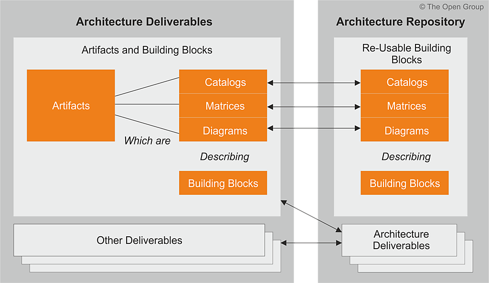

title: E-Service Etapa 2. Arquitectura de Referencia SOA 2.0 del FNA
geometry:
  - top=1in
  - bottom=1in
fignos-cleveref: True
fignos-plus-name: Fig.
fignos-caption-name: Imagen
tablenos-caption-name: Tabla
...

<small><em>Los productos de esta etapa ([Web](https://hwong23.github.io/fna-dd-f2-pry2-e3/v/e1dbb95300ecbdc2619802782fc969667115046b/))
están basados en el resultado de la consultoría "Arquitectura E-Service",
[Sharepoint STEF@e1dbb95](https://stefaninilatam.sharepoint.com/:f:/r/sites/PROYECTOARQUITECTURAE-SERVICEFNA/Documentos%20compartidos/General/Repositorio%20SOA/Procesos%20Fase%20II/181-2020.%20E-SERV.%20Fase%202-ETAPA%200.%20docx?csf=1&web=1&e=BiNcBP)
del August 11, 2023.
</em></small>

|    **Versión** del producto 1.e1dbb95 de 11 Aug 2023

 

## Autores

+ **Harry Wong, ing.**
   
    · {.inline_icon width=16 height=16}
    [e_hwong](https://github.com/e_hwong)
     
  <small>
     Arquitecto SOA, Stefanini
  </small>

+ **Wilson Morales, ing.**
   
    · {.inline_icon width=16 height=16}
    [wmorales](https://github.com/wmorales)
     
  <small>
     Software, Aplicaciones
  </small>

+ **Sergio Andrés Castro Hernandez, ing.**
   
    · {.inline_icon width=16 height=16}
    [fhernandez](https://github.com/fhernandez)
     
  <small>
     SOA, Arquitectura
  </small>

+ **Viviana M. Martinez, ing.**
   
    · {.inline_icon width=16 height=16}
    [vmmartinez](https://github.com/vmmartinez)
     
  <small>
     Analista, Proyectos
  </small>

::: {#correspondence}
✉ — Enviar mensajes a Harry Wong, ing. \<e_hwong@stefanini.com\>.

:::

 

## Objetivo del Documento
Entrega de los productos de la Etapa 2, PR11 y PR12, del proyecto PR02, Arquitectura de Referencia SOA 2.0 del FNA, flujos de trabajo y personas que ejercitan y conforman (cumplen) con el gobierno SOA del FNA a desplegar a cargo de la oficina de arquitectura.

##  Control de Cambios {.page_break_before}
| Tema           | PRY02 Arquitectura de Referencia SOA 2.0 del FNA      |
|----------------|----------------------------|
| Palabras clave | SOA, E-Service, FNA, Análisis de brecha, GAP, Comparativa              |
| Autor          |                            |
| Fuente         |                            |
| Versión        | 1.e1dbb95 del 11 Aug 2023 |
| Vínculos       | [N003a Vista Segmento SOA FNA](N03a%a20Vsta%20aSegenta%20SOA%20FNA.md) |

 

 

## Contenidos
\toc

---
pr14nombre: "Administración de las transiciones hacia la arquitectura versión 2.0"
...

\newpage

>    E-Service. Fase II
>
>    PRY02. Arquitectura de Referencia SOA 2.0 del FNA. Contenido de los Productos Contractuales
>
>    Contrato 1812020
>
>    FNA, Stefanini
>
>    11 Aug 2023
>
>    **Versión** 1.e1dbb95

 

# Producto 15: PR15. Inventario de artefactos genéricos y concretos de aceleración de implementación
Recogemos en este producto el concepto del _bloque de construcción abstracto_ (ABB, por su siglas en inglés) promovido por TOGAF, y que a su vez podemos hallar su raíz en el concepto del plantilla de tipos o tipos de datos genéricos proveniente del paradigma orientado a objetos. En este producto trataremos de los bloques de construcción genéricos del FNA necesarios para normalizar la elaboración de diseños de solución y transición (dicha elaboración actual los cuales no son del alcance de este producto, ni del proyecto actual).

**Nota**: los análisis de este producto están dirigidos a cumplir los objetivos del proyecto PRY01, Gobierno SOA: desarrollo, gestión, gobierno de arquitectura y adopción.

 

## Justificación
Los bloques de construcción abstractos, o genéricos en este contexto, son diseños previamente validados que pueden ser utilizados directamente en los procesos de elaboración de arquitecturas de solución y de transición en las que la arquitectura de referencia esté involucrada. Estos prediseños son importantes por razones de la aceleración que le aportan a la elaboración de estas transiciones, pero también por la normalización y reutilización que suponen en esto mismo, y porque están directamente asociados con una forma de solucionar el problema del tiempo de mercado diagnosticado en Fase I de esta consultoría.

## Contenidos
1. Definición de los Bloques de Construcción Abstractos del FNA (BCAF)
1. Métodos para la gestión y evolución de los Bloques de Construcción Abstractos del FNA (BCAF)
1. Listado de Bloques de Construcción Abstractos del FNA (BCAF)
1. Utilización de los Bloques de Construcción Abstractos en el FNA

 

## Criterios de Aceptación
* Entendimiento del concepto del bloque de construcción genérico
* Entendimiento del uso de los prediseños de arquitectura 
* Entrega del listado de Bloques de Construcción Abstractos del FNA (BCAF)Lista de 

 

## Modelo de Implementación del PRY02
{#fig: width=}

_Fuente: Elaboración propia._

 

---
prnombre: "Inventario de artefactos genéricos y concretos de aceleración de implementación"
...

\newpage

| Tema           | Administración de las transiciones hacia la arquitectura versión 2.0: **Definición de los Bloques de Construcción Abstractos del FNA (BCAF)** |
|----------------|----------------------------------------------------------------------|
| Palabras clave | SOA, Arquitectura de referencia, Bloques de construcción, Genéricos, Reutilización, Tiempo de mercado                    |
| Autor          |                                                              |
| Fuente         |                                                              |
| Versión        | **1.e1dbb95** del 11 Aug 2023                       |
| Vínculos       | [Ejecución Plan de Trabajo SOA](onenote:#N001d.sharepoint.com); [Procesos de Negocio FNA](onenote:#N003a.com)|

 

# Anexo 1. Población de servicios del portafolio FNA
La tabla siguiente muestra la población de servicios del portafolio FNA.

|                      |              |
|----------------------|--------------|
| **Tipo Servicio**    | **Cantidad** |
| Servicio Información | **55**       |
| Servicio Proceso     | 18           |
| Servicio Negocio     | 14           |
| **Total general**    | **87**       |

[Tabla.]() Catalogación de los tipos de servicios SOA del FNA.

_Fuente: elaboración propia, FNA_PortafolioServiciosFinal+ConsumidoresyProveedores.xlsx_

Los servicios de negocio, aquellos que elaboran una respuesta mediante un cómputo (sea cálculo, diferencia, comparación...), y por tanto, los que inciden en la flexibilidad de negocio, son los de menor presencia en el portafolio FNA.

 

# Anexo 2. Flujo de Trabajo de la Oficina de Arquitectura
El flujo de trabajo de la oficina de arquitectura es un mecanismo de prevención de las carencias de gobierno 0.2 del FNA (ver [Análisis de susceptibilidad de gobierno (PR01)](../../fna-dd-f2-pry1/content/01a3.flujos.md), y [Anexo 1. Susceptibilidades de Gobierno (PR01)](https://stefaninilatam.sharepoint.com/SitePages/Home.aspx)), al refinar el proceso de colaboración y autoría de modelos, lo mismo, que al tomar como base del trabajo al repositorio de arquitectura del FNA. El flujo de trabajo de arquitectura resalta los roles y responsabilidades de los participantes: arquitectos FNA, arquitectos solución (proveedores), administradores del repositorio de arquitectura, revisores y aprobadores, y audiencia objetivo de los resultados del trabajo.

Para cubrir los casos más significativos del análisis de susceptibilidad de gobierno, hemos creado los flujos de trabajo interno, y su alternativa, el de proveedores, definidos para priorizar la atención a tales problemas. Los problemas de gobierno referidos son

## Flujo de Trabajo Oficina de Arquitectura Interno (FLUJ01)
Desarrollamos dos flujos fundamentales de la oficina de arquitectura. El primero, el FLUJ01. Diseño y Análisis de Modelos de Arquitectura del FNA, se ejecuta cada vez que exista una petición de requerimiento de cambio de arquitectura. Los demás pasos de este flujo se resumen a continuación.

1. Recibe el requerimiento de arquitectura
    * Inicia el proceso ADM - Fase de preliminar: alistamiento y aprobación​
    * Arranca el modelado​ inicial o incremental, nivel 100 [^1]
1. El arquitecto de solución continúa el proceso ADM - solicita implementación / gobierno

[^1]: Niveles de detalle de la ingeniería: https://editeca.com/lod-nivel-de-desarrollo/

 

La siguiente imagen ilustra los pasos descritos.

{#fig:flujoADM-1.png width=}

_Fuente: Elaboración propia._

 

El flujo interno tiene un propósito acotado a los asuntos concernientes a los involucrados de la oficina de arquitectura, adscrita a la vicepresidencia de tecnología del FNA. No debe, por tanto, dar alcance a los trabajos que se estén realizando con otras oficinas del Fondo, como por ejemplo Planeación, o con arquitectos externos, proveedores o fábricas de software. De esto último es precisamente de lo que se encarga el flujo no. 2, Flujo de Trabajo Oficina de Arquitectura Proveedores, descrito más adelante. El flujo interno de la oficina puede, sin embargo, y con mucha frecuencia lo hará, dar inicio a un flujo 2, que de colaboración entre oficinas y proveedores y fábricas se trata.

 

# La Problemática del Tiempo de Mercado (salidas a producción) en el FNA
Con base a los diagnósticos de población del portafolio de servicios SOA del FNA (ver @eservices1-22), el cual trata de la clasificación de servicios, tenemos el hecho de que la _mayor cantidad de servicios del portafolio son del tipo servicios de información_ (ver [Anexo 2. Población de servicios del portafolio FNA]). 

Lo anterior significa que la mayor cantidad de servicios SOA que son relevantes para el Fondo Nacional existen para únicamente para propósitos de transporte de información. Esto es, sirven para responder a solicitudes de información que los procesos o aplicaciones se hacen entre ellos. Esta característica de la población del portafolio de servicios se vuelva una situación desfavorable para los cambios de negocio que se ven afectados por el esfuerzo en mantenimiento y gobierno SOA que consumen aquellos otros servicios en detrimento de los servicios de negocio. 

    Los servicios de negocio, aquellos que elaboran una respuesta mediante un cómputo (sea cálculo, diferencia, comparación...), y por tanto, los que inciden en la flexibilidad de negocio, son los de menor presencia en el portafolio FNA.

El esfuerzo que toman los cambios en los servicios de transporte de información debe estar influyendo en inclinar los tiempos hacia el mantenimiento de servicios de información en lugar de a la velocidad de salida (tiempo de mercado) de las funcionalidades de negocio.

Esto último es lo que determina la problemática de la demora en el tiempo de mercado/salida a producción del FNA

# Propuesta de Flexibilidad y Mejora del Tiempo de Mercado del FNA
## Bloques Genéricos de Construcción de la Arquitectura de Referencia
Desde la arquitectura de referencia SOA 2.0 del FNA hacemos la propuesta de  mejoramiento de los tiempos de mercado del FNA son aquellos referidos en los pasos no. 2 y 5 del flujo de trabajo de la Oficina de Arquitectura y son en realidad paquetes de funcionalidad definidos por las necesidades de negocio o del arquitecto. Estos bloques pueden implementar a cualquier clasificador (objeto material) de los modelos del repositorio de arquitectura empresarial.

Ejemplo de estos bloques predefinidos en el repositorio de arquitectura pueden ser un proceso, un actor, un servicio, una aplicación, o una entidad de datos que haga parte del glosario de contenidos de la empresa Fondo Nacional. 

Los bloques genéricos deben cumplir algunas reglas, como que siempre deben  representar una necesidad concisa de negocio o de arquitectura, que representen un único concepto con límites claros, y que sera reconocible como 'parte' en un dominio de la arquitectura. Puede o no interoperar con otros bloques, en cuyo caso también habrá que definirlos. Es importante que un bloque de construcción tenga una implementación lógica en el repositorio, además de un uso, y que esté implementado y evolucione mediante la tecnología. 

Los bloques de solución pueden estar compuesto por otros, en cuyo caso serán un ensamblado; pueden ser descompuestos (desensamblado) en los bloques pequeños que los constituyen. 

Una regla necesaria a la hora de diseñar e implementar un bloque de construcción genérico, y obligatorio, que sea reutilizable, reemplazable, y especificado a conformidad.

Los sistemas y herramientas de software de la arquitectura del FNA deben estar creados a partir de colecciones de bloques de solución. De ahí que estos bloques deban tener una interfaz de interacción clara y estable para con otros bloques. 

Lo más importante de este concepto de bloques genérico es que sea incremental. Es decir, que sea creado mediante el de los niveles de detalle (100 al 500). Por ejemplo, a nivel 100, el arquitecto del FNA podría dar comienzo al modelado de un bloque de genérico mediante un nombre, una descripción o un esquema. Luego, el arquitecto de solución, puede descomponer este mismo bloque en múltiples construcciones acompañada de una especificación más detallada (nivel 200 al 500).

En la siguiente imagen ilustramos una representación de un bloque genérico y los elementos con los que se implementan en el repositorio de arquitectura del FNA.. 

{#fig:bb.png width=}

_Fuente: TOGAF 9.1._

 

## Bloques Genéricos de Construcción. Definición
Un bloque de construcción representa un componente (potencialmente reutilizable) de una única capacidad de la arquitectura de referencia del FNA, objeto de este proyecto. Puede ser ensamblado con otros bloques de construcción para agilizar la creación de arquitecturas y soluciones posteriores. 

Los bloques de construcción genéricos deben tener asociado una contraparte usable llamada _bloque de solución_. Un bloque de solución representan los componentes que se utilizarán para implementar a un bloque genérico. Por ejemplo, 

    "Una red es un bloque de construcción que puede describirse a través de artefactos complementarios y luego ponerse en uso para realizar soluciones para la empresa". Nota: basado en la definición de TOGAF 9.1.

 

# Definición de los Bloques de Construcción Abstractos del FNA (BCAF)

---
prnombre: "Inventario de artefactos genéricos y concretos de aceleración de implementación"
...

\newpage

| Tema           | Administración de las transiciones hacia la arquitectura versión 2.0: **Listado de Bloques de Construcción Abstractos del FNA (BCAF)** |
|----------------|----------------------------------------------------------------------|
| Palabras clave | SOA, Arquitectura de referencia, Bloques de construcción, Genéricos, Reutilización, Tiempo de mercado                    |
| Autor          |                                                              |
| Fuente         |                                                              |
| Versión        | **1.e1dbb95** del 11 Aug 2023                       |
| Vínculos       | [Ejecución Plan de Trabajo SOA](onenote:#N001d.sharepoint.com); [Procesos de Negocio FNA](onenote:#N003a.com)|

 

# Listado de Bloques de Construcción Abstractos del FNA
Existen varios enfoques diferentes para acelerar la implementación de una arquitectura. En este ejercicio de arquitectura de referencia hemos propuesto el los bloques de construcción genéricos SOA, los cuales ayudan a seleccionar la solución adecuada para el contexto que la requiera. La solución de los bloques genéricos comportan una ventaja adicional, que no es menor, por lo que tienden a disminuir la densidad de errores en las implementaciones de arquitectura al partir de una construcción base, si bien abstracta, agiliza el inicio del proceso de construcción, que es precisamente la más propensa al error.

Presentamos a continuación la lista de bloques de construcción genéricos recomendados para agilizar la construcción de arquitecturas en el FNA.

1. Organización de inventario
   * Inventario empresarial
   * Normalización de servicios
   * Esquema canónico
   * Estratos de servicios
2. Gobierno de Servicios
   * Versionamiento
   * Reforma de servicio
   * Descomposición de servicios
3. Implementación de servicios
   * Fachadas
   * Redundancia
   * Replicación
   * Mediador UI
4. Seguridad
   * Confidencialidad
   * Autenticación de mensaje / datos
   * Autenticación directa
   * Mediación de autenticación 
5. Contratos
   * Contrato desacoplado
   * Contrato centralizado
6. Organización de servicios
   * Descomposición funcional
   * Encapsulamiento de servicio
   * Contexto agnóstico
7. Manejo de legados
   * Envoltura de legado
   * Punto multicanal
   * Compuerta de archivo
8. Manejo de capacidades
   * Composición de capacidades
   * Recomposición de capacidades
9. Mensajes de servicios
   * Mensajería entre servicios
   * Agentes
   * Interruteo
   * Mensajería con estado
   * Devolución de llamado (callback)
   * Encolado asíncrono
   * Mensajería confiable
   * Mensajería eventual
10. Diseño de composiciones
	* Orquestación
	* ESB
	* Intermediación
11. Implementación de composición
	* Controlador secundario (agnóstico)
	* Autonomía de la composición 
	* Transacción atómica
	* Compensación transaccional

 

Nota: la lista de bloques genéricos aquí presentados requieren de implementación, pero esta no hace parte del alcance del proyecto actual.

 

\newpage

# Referencias {.page_break_before}
<!-- Explicitly insert bibliography here -->

@eservices1-22 @eservices3-22 @eservices4-22 @eservices5-23 @eservices6-12 @eservices7-23 @bptrends07

