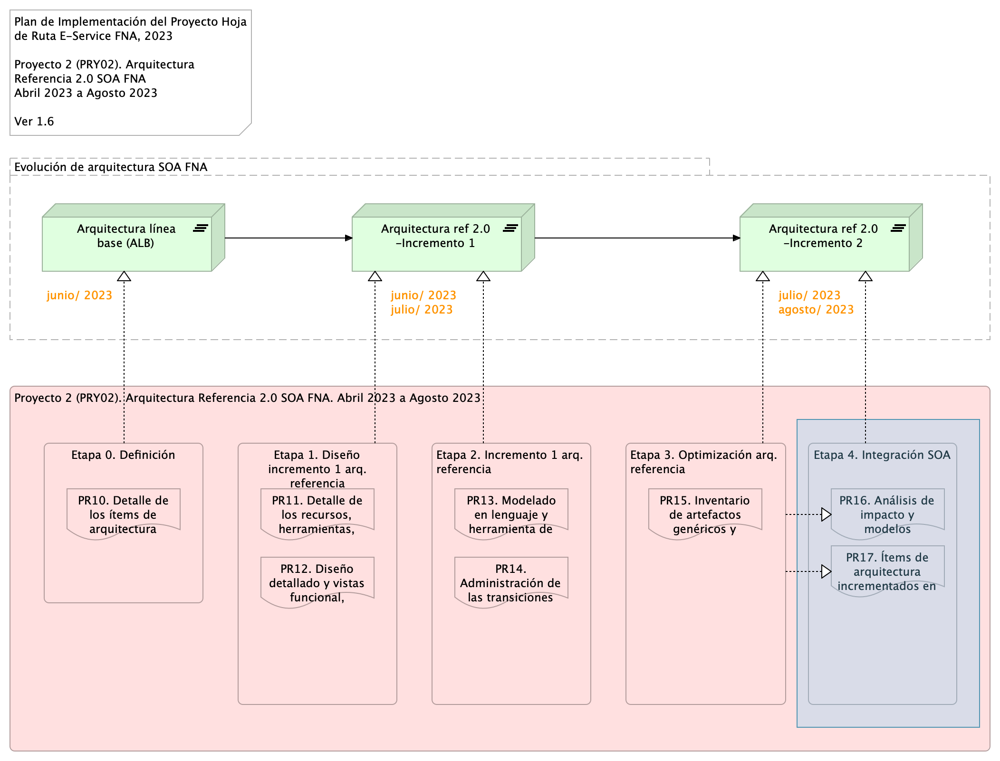

title: E-Service Etapa 2. Arquitectura de Referencia SOA 2.0 del FNA
geometry:
  - top=1in
  - bottom=1in
fignos-cleveref: True
fignos-plus-name: Fig.
fignos-caption-name: Imagen
tablenos-caption-name: Tabla
...

<small><em>Los productos de esta etapa ([Web](https://hwong23.github.io/fna-dd-f2-pry2-e3/v/4875f5686792be0c1dd586f352837c0d780ee347/))
están basados en el resultado de la consultoría "Arquitectura E-Service",
[Sharepoint STEF@4875f56](https://stefaninilatam.sharepoint.com/:f:/r/sites/PROYECTOARQUITECTURAE-SERVICEFNA/Documentos%20compartidos/General/Repositorio%20SOA/Procesos%20Fase%20II/181-2020.%20E-SERV.%20Fase%202-ETAPA%200.%20docx?csf=1&web=1&e=BiNcBP)
del August 10, 2023.
</em></small>

|    **Versión** del producto 1.4875f56 de 10 Aug 2023

 

## Autores

+ **Harry Wong, ing.**
   
    · {.inline_icon width=16 height=16}
    [e_hwong](https://github.com/e_hwong)
     
  <small>
     Arquitecto SOA, Stefanini
  </small>

+ **Wilson Morales, ing.**
   
    · {.inline_icon width=16 height=16}
    [wmorales](https://github.com/wmorales)
     
  <small>
     Software, Aplicaciones
  </small>

+ **Sergio Andrés Castro Hernandez, ing.**
   
    · {.inline_icon width=16 height=16}
    [fhernandez](https://github.com/fhernandez)
     
  <small>
     SOA, Arquitectura
  </small>

+ **Viviana M. Martinez, ing.**
   
    · {.inline_icon width=16 height=16}
    [vmmartinez](https://github.com/vmmartinez)
     
  <small>
     Analista, Proyectos
  </small>

::: {#correspondence}
✉ — Enviar mensajes a Harry Wong, ing. \<e_hwong@stefanini.com\>.

:::

 

## Objetivo del Documento
Entrega de los productos de la Etapa 2, PR11 y PR12, del proyecto PR02, Arquitectura de Referencia SOA 2.0 del FNA, flujos de trabajo y personas que ejercitan y conforman (cumplen) con el gobierno SOA del FNA a desplegar a cargo de la oficina de arquitectura.

##  Control de Cambios {.page_break_before}
| Tema           | PRY02 Arquitectura de Referencia SOA 2.0 del FNA      |
|----------------|----------------------------|
| Palabras clave | SOA, E-Service, FNA, Análisis de brecha, GAP, Comparativa              |
| Autor          |                            |
| Fuente         |                            |
| Versión        | 1.4875f56 del 10 Aug 2023 |
| Vínculos       | [N003a Vista Segmento SOA FNA](N03a%a20Vsta%20aSegenta%20SOA%20FNA.md) |

 

 

## Contenidos
\toc

\newpage

>    E-Service. Fase II
> 
>    PRY02. Arquitectura de Referencia SOA 2.0 del FNA. Contenido de los Productos Contractuales
> 
>    Contrato 1812020
> 
>    FNA, Stefanini
> 
>    10 Aug 2023
>
>    **Versión** 1.4875f56

 

# Producto 10: PR10. Detalle de los ítems de la empresa FNA impactados por el proyecto
Lista de las partes de la arquitectura actual del FNA relacionados con el diseño de la arquitectura de referencia SOA 2.0, objeto del proyecto.

**Nota**: el resultado de este producto está dirigido a cumplir los objetivos del proyecto PRY02. Arquitectura de Referencia SOA 2.0 del FNA: desarrollo, sostenibilidad (gestión) de arquitectura de referencia.

 

## Justificación
Adelantar la aprobación por parte del Fondo Nacional del Ahorro de los contenidos de los entregables del proyecto PRY02, en su  Etapa 0, de la Hoja de Ruta E-Service, tal que garantice su continuidad y ejecución.

## Contenidos
1. Vista de segmento de la empresa, campo de acción del proyecto PRY02
1. Justificación del segmento de la empresa requerido por el trabajo de arquitectura SOA de referencia 2.0
1. Iniciativas y brechas sensibles al trabajo de arquitectura de referencia 2.0 (relación con E-Service, Fase I)

 

## Criterios de Aceptación
* Lista de los ítems de arquitectura y brechas críticas del trabajo atendidos por la arquitectura de referencia SOA 2.0 del FNA
* Descripción de los ítems del segmento de la empresa del proyecto 2 (PRY02), Arquitectura de Referencia SOA 2.0 del FNA

 

## Modelo de Implementación del PRY02
{#fig: width=lin}

_Fuente: Elaboración propia._

 

\newpage

| Tema           | Vista de Contexto: **Elementos de la Arquitectura Impactados por el Proyecto** |
|----------------|--------------------------------------------------------------------|
| Palabras clave | SOA, Contexto, Áreas, Procesos, Objetivos   |
| Autor          |                                             |
| Fuente         |                                             |
| Versión        | 1.4875f56 del 10 Aug 2023            |
| Vínculos       | [N001d. Ejecución Plan de Trabajo SOA](onenote:#N001d.sharepoint.com); [N003a. Procesos de Negocio FNA](onenote:#N003a.%20Procesos%20de%20Negocio%20FNA&section)|

 

# Vista de Contexto Fase II, E-Service, 2023 (181-2020)
## Elementos de la Arquitectura Impactados por el Proyecto
La vista de contexto o del segmento de empresa presenta un corte de la arquitectura del Fondo Nacional del Ahorro (FNA, en adelante) que será abordada por este proyecto. Por tanto, esta vista es una porción de la empresa FNA (segmento de empresa) acotada a las partes que son sujeto del trabajo del proyecto , Arquitectura de Referencia SOA 2.0 del FNA, Fase II, E-Service (contrato 181-2020). Si bien, esta vista presenta únicamente las partes directamente relacionadas con este proyecto, también presenta la relación indirecta a otros ítems de la arquitectura del FNA a los que este alcanza.

La vista de segmento a continuación presenta las partes de la arquitectura del FNA que son sujeto de este proyecto .

{#fig:1 width=lin}

_Fuente: Elaboración propia._

 

Esta vista le informa al FNA tres objetivos importantes. Primero, que el ejercicio actual, Arquitectura de Referencia SOA 2.0 del FNA, aunque sea de carácter empresarial, está ubicado en TI, y está condicionada por las restricciones del proyecto presente. Por esta razón, no puede abarcar la completitud de la empresa FNA, sino únicamente las partes seleccionadas como relevantes. De ahí que la vista del segmento de la empresa informa de aquellas partes: la vista de segmento presentada en la imagen arriba hace foco en las dichas partes, capacidades del FNA, en esos procesos, y los artefactos de software, componentes y servicios SOA que son relevantes en las restricciones de ejecución (tiempo y recursos contratados) y resultados esperados de este proyecto (productos contractuales).

Segundo, la vista de contexto comunica las problemáticas que el proyecto debe enfrentar, que sucede en las partes de la empresa que esta incluye, y las operaciones a realizar a aquellas partes de la empresa FNA. Las operaciones, que pueden ser diagnósticos, análisis, procedimientos, a realizar aparecen en forma de trabajo, al final de la vista. Por ejemplo, se deberán realizar para producir una solución dentro de los términos del proyecto, que en este caso, es el de Gobierno SOA.

Tercero y último, la vista de segmento FNA del proyecto facilita la justificación y explicación de los criterios con los que se realizó la inclusión de las partes de la emprasa que esta incluye, así como de nuevos ítems que pueda incluir durante la ejecución del proyecto.

 

## Descripción de los Elementos de la Vista de Segmento
La vista de segmento que define los ítems de arquitectura del FNA a ser abordados en esta etapa del proyecto; <mark>comprenden los siguientes</mark>
elementos.

1. Los procesos de Diseño de Servicios y Soluciones FNA y Verificación y Calidad de Implementación
1. Los objetivos representados en el gobierno y adopción de la arquitectura
1. Los servicios derivados del _Diseño de Servicios y Soluciones FNA_ y _Verificación y Calidad de Implementación_
1. La infraestructura tecnológica que soporta los servicios

 

### PROC4. Diseño de Servicios y Soluciones FNA
El diseño de servicios y soluciones, constituye una competencia a desarrollar y madurar al interior del FNA, en concordancia con las recomendaciones de los marcos de referencia: _e-Competence Framework (e-CF)—A common European Framework for ICT Professionals in all industry sectors—Part 1: Framework, 2016_ en los cuales la etapa de diseño está alineada con los requisitos de los servicios demandados por los interesados, su posterior desarrollo, la adquisición o contratación y el gobierno que se hace necesario implementar para soportar la operación:

* Gestión de la configuración
* Preparación y ejecución de pruebas
* Gestión de Requisitos y Mantenimiento
* Atención de problemas
* Atención de incidentes

El Diseño de Servicios y Soluciones, garantiza una prestación ágil y escalable de servicios y soluciones digitales del FNA, además de oportunas y rentables, capaces de apoyar los objetivos trazados en la vista de segmento de esta etapa del proyecto.

Estas soluciones digitales pueden adoptar varias formas, desde aplicaciones móviles, plataformas en línea, software personalizado, y sistemas de gestión empresarial, entre otros.

Por otra parte y en articulación al Marco para la Transformación Digital del Estado Colombiano, del MinTIC, el diseño de servicios y soluciones, integra habilidades del FNA, orientadas principalmente a lo siguiente.

* Diseño con enfoque centrado en los usuarios beneficiarios del FNA
* Solución de problemas complejos a través de la arquitectura
* Diseños ágiles desde la perspectiva de salida a producción y con un adecuado uso de recursos

Estos elementos y características corresponderán a los atributos del proceso Diseño de Servicios y Soluciones FNA, de la vista de segmento del FNA.

### PROC5. Verificación y Calidad de Implementación
Este componente dentro de la vista de arquitectura de segmento, define el éxito del diseño de servicios y soluciones, debido a la consideración de buenas prácticas, cumplimiento de normas y un adecuado gobierno en la etapa de diseño, hasta llegar a la implementación y puesta en funcionamiento.

La verificación y calidad de implementación dentro de la arquitectura de segmento, asegura que el diseño tuvo una planificación adecuada, un equipo de trabajo con las competencias necesarias, una comunicación asertiva, un modelo de desarrollo y ejecución de pruebas, un mecanismo gradual de
implementación, las respectivas capacitaciones, los requerimientos de seguridad y privacidad y la generación de hábitos y comportamientos a través del uso y apropiación de la solución desplegada.

Dentro del alcance de esta fase del proyecto, se contempla el diseño del Gobierno SOA, compuesto por elementos con líneas de actuación en completa articulación; los resultados de uno, impactan los resultados y el accionar de los demás.

Estos elementos que se relacionan a continuación:
 
* Procesos
* Estructura
* Habilidades y Competencias
* Políticas
* Cultura y Ética
* Infraestructura
* Elementos de Información\ 

 

### OBJ10. Desarrollo de Arquitecturas FNA
Dentro del dominio motivacional; una de las metas claves de la vista de segmento corresponde al desarrollo de arquitecturas, como elementos rectores de gobierno de los procesos: _Diseño de Servicios y Soluciones FNA_ y _Verificación y Calidad de Implementación_.

De acuerdo con el Marco de Referencia de Arquitectura Empresarial (MRAE) del MinTIC es necesario generar una articulación entre: las iniciativas que se generan desde los dos procesos que son parte del alcance de esta fase; la ejecución de los proyectos que se generaron a partir de aquellas iniciativas; y una gestión y monitoreo de los impactos de la finalización de los proyectos y los productos que 
entregan a nivel de servicios.

A través de la práctica de arquitectura, el FNA empieza a generar un gobierno del diseño y posterior implementación de los servicios y soluciones digitales que presta a los ciudadanos.

### OBJ11. Gestión de Arquitectura FNA
Este componente está orientado a la instauración del Gobierno de Arquitectura; con los elementos que lo componen: procesos, estructura, habilidades y competencias, políticas, cultura y ética, y elementos de información.

Es un objetivo por cumplir para los procesos definidos en esta fase: _Diseño de Servicios y Soluciones FNA_ y _Verificación y Calidad de Implementación_.

 

#Vistas de Apoyo al Segmento de la Empresa

{#fig: width=}

_Fuente: Diagnóstico SOA. E-Service (2022)._

 

{#fig: width=}

_Fuente: Diagnóstico SOA. E-Service (2022)._

 

{#fig: width=}

_Fuente: Diagnóstico SOA. E-Service (2022)._

 

{#fig: width=}

_Fuente: Diagnóstico SOA. E-Service (2022)._

 

{#fig: width=}

_Fuente: Diagnóstico SOA. E-Service (2022)._

 

{#fig: width=}

_Fuente: Diagnóstico SOA. E-Service (2022)._

 

---
pr14nombre: "Administración de las transiciones hacia la arquitectura versión 2.0"
...

\newpage

>    E-Service. Fase II
>
>    PRY02. Arquitectura de Referencia SOA 2.0 del FNA. Contenido de los Productos Contractuales
>
>    Contrato 1812020
>
>    FNA, Stefanini
>
>    10 Aug 2023
>
>    **Versión** 1.4875f56

 

# Producto 15: PR15. Inventario de artefactos genéricos y concretos de aceleración de implementación
Recogemos en este producto el concepto del _bloque de construcción abstracto_ (ABB, por su siglas en inglés) promovido por TOGAF, y que a su vez podemos hallar su raíz en el concepto del plantilla de tipos o tipos de datos genéricos proveniente del paradigma orientado a objetos. En este producto trataremos de los bloques de construcción genéricos del FNA necesarios para normalizar la elaboración de diseños de solución y transición (dicha elaboración actual los cuales no son del alcance de este producto, ni del proyecto actual).

**Nota**: los análisis de este producto están dirigidos a cumplir los objetivos del proyecto PRY01, Gobierno SOA: desarrollo, gestión, gobierno de arquitectura y adopción.

 

## Justificación
Los bloques de construcción abstractos, o genéricos en este contexto, son diseños previamente validados que pueden ser utilizados directamente en los procesos de elaboración de arquitecturas de solución y de transición en las que la arquitectura de referencia esté involucrada. Estos prediseños son importantes por razones de la aceleración que le aportan a la elaboración de estas transiciones, pero también por la normalización y reutilización que suponen en esto mismo, y porque están directamente asociados con una forma de solucionar el problema del tiempo de mercado diagnosticado en Fase I de esta consultoría.

## Contenidos
1. Definición de los Bloques de Construcción Abstractos del FNA (BCAF)
1. Métodos para la gestión y evolución de los Bloques de Construcción Abstractos del FNA (BCAF)
1. Listado de Bloques de Construcción Abstractos del FNA (BCAF)
1. Utilización de los Bloques de Construcción Abstractos en el FNA

 

## Criterios de Aceptación
* Entendimiento del concepto del bloque de construcción genérico
* Entendimiento del uso de los prediseños de arquitectura 
* Entrega del listado de Bloques de Construcción Abstractos del FNA (BCAF)Lista de 

 

## Modelo de Implementación del PRY02
{#fig: width=}

_Fuente: Elaboración propia._

 

---
prnombre: "Inventario de artefactos genéricos y concretos de aceleración de implementación"
...

\newpage

| Tema           | Administración de las transiciones hacia la arquitectura versión 2.0: **Definición de los Bloques de Construcción Abstractos del FNA (BCAF)** |
|----------------|----------------------------------------------------------------------|
| Palabras clave | SOA, Arquitectura de referencia, Bloques de construcción, Genéricos, Reutilización, Tiempo de mercado                    |
| Autor          |                                                              |
| Fuente         |                                                              |
| Versión        | **1.4875f56** del 10 Aug 2023                       |
| Vínculos       | [Ejecución Plan de Trabajo SOA](onenote:#N001d.sharepoint.com); [Procesos de Negocio FNA](onenote:#N003a.com)|

 

# La Problemática del Tiempo de Mercado (salidas a producción) en el FNA
Con base a los diagnósticos de población del portafolio de servicios SOA del FNA (ver @eservices1-22), el cual trata de la clasificación de servicios, tenemos el hecho de que la _mayor cantidad de servicios del portafolio son del tipo servicios de información_ (ver anexo 1, Población de servicios del portafolio SOA del FNA). 

Lo anterior responde a que la mayor cantidad de servicios SOA que son relevantes para el Fondo sirven para transportar información, esto es, para responder a solicitudes de información de los procesos o aplicaciones. Así mismo, este grupo influye en la cantidad de esfuerzo en mantenimiento y gobierno SOA. Los servicios de negocio, aquellos que elaboran una respuesta mediante un cómputo (sea cálculo, diferencia, comparación...), y por tanto, inciden en la flexibilidad de negocio, son los de menor presencia en el portafolio FNA.

 

**Es importante** tener esta población presente porque puede estar influyendo en inclinar los esfuerzos hacia el mantenimiento de servicios de información, en lugar de a la velocidad de salida (tiempo de mercado) de las funcionalidades de negocio.

 

# Definición de los Bloques de Construcción Abstractos del FNA (BCAF)

## Anexo 1. Población de servicios del portafolio FNA.
La tabla siguiente muestra la población de servicios del portafolio FNA.

|                      |              |
|----------------------|--------------|
| **Tipo Servicio**    | **Cantidad** |
| Servicio Información | **55**       |
| Servicio Proceso     | 18           |
| Servicio Negocio     | 14           |
| **Total general**    | **87**       |

[Tabla.]() Catalogación de los tipos de servicios SOA del FNA.

_Fuente: elaboración propia, FNA_PortafolioServiciosFinal+ConsumidoresyProveedores.xlsx_

 

---
prnombre: "Análisis de impacto y modelos actualizados de los ítems de arquitectura"
...

\newpage

>    E-Service. Fase II
>
>    PRY02. Arquitectura de Referencia SOA 2.0 del FNA. Contenido de los Productos Contractuales
>
>    Contrato 1812020
>
>    FNA, Stefanini
>
>    10 Aug 2023
>
>    **Versión** 1.4875f56

 

# Producto 16: PR16. Análisis de impacto y modelos actualizados de los ítems de arquitectura
Similar al ejercicio del producto 6, Modelos actualizados de los ítems de arquitectura impactados (PR06), del proyecto PRY01 de esta misma consultoría, en este producto hacemos lo propio respecto de los modelos de la arquitectura de referencia 2.0 del FNA. Por tanto, en este producto organizamos y consolidamos en el depósito de arquitectura del FNA (propuesto por esta misma consultoría) la información de los modelos de la arquitectura de referencia SOA 2.0 del FNA. A este lo complementa el análisis de impacto inicial que trate sobre las implicaciones de la adopción de los cambios funcionales y tecnológicos enunciados por esta arquitectura camino a ser el mapa de viaje de la transformación de las capacidades de negocio y de arquitectura del FNA (ver [Producto 11](<../../fna-dd-f2-pry2-e1/content/11.detalle roles recursos.md>) de este proyecto).

Al repositorio línea base entregado por el proyecto 1 (anterior a este) agregamos nuevos modelos a razón de la  arquitectura de referencia y del ejercicio de este producto.

| Tipo de Entrada      |          |
|----------------------|---------:|
| Arquitectura         | 12       |
| Funcional            | 4        |
| **Total Contenidos** | **1311** |

**Nota**: los análisis de este producto están dirigidos a cumplir los objetivos del proyecto PRY01, Gobierno SOA: desarrollo, gestión, gobierno de arquitectura y adopción.

 

## Justificación
Uno de los objetivos nominales, y objeto del proyecto actual, es la creación de la primera versión de la arquitectura de referencia SOA del FNA proyecto. Objetivo que se pliega al de _aumentar la relevancia de los modelos de arquitectura del Fondo Nacional_. En este proyecto 2 de Fase, II E-Service, los modelos son instrumentos de encuentro para el entendimiento, análisis, y comunicación entre actores, como ingenieros, arquitectos, proveedores, líderes de grupo. Se cumple también la máxima de proyectos anteriores de esta misma consultoría: los modelos, en este caso de la arquitectura de referencia, son por el sujeto principal, y la evidencia, de la existencia del gobierno. Por estas razones es que los modelos de referencia SOA 2.0 creados aquí tienen la importancia tal para ser entregados en contribución al repositorio de arquitectura de la empresa.

## Contenidos
1. Definición de los Bloques de Construcción Abstractos del FNA (BCAF)
1. Métodos para la gestión y evolución de los Bloques de Construcción Abstractos del FNA (BCAF)
1. Listado de Bloques de Construcción Abstractos del FNA (BCAF)
1. Utilización de los Bloques de Construcción Abstractos en el FNA

 

## Criterios de Aceptación
1. Detalle de ítems de la línea base de arquitectura de referencia 2.0 del FNA
1. Repositorio de arquitectura del FNA, versión 0.5, actualizado con arquitectura de referencia
1. Consideraciones para la adopción y puesta en marcha de los cambios en las arquitecturas del FNA
1. Anexo. Herramienta de navegación del repositorio de arquitectura del FNA versión 0.3

 

## Repositorio de Arquitectura del FNA, versión 0.5
{#fig: width=}

_Fuente: Diagnóstico SOA. E-Service (2022)._

## Modelo de Implementación del PRY02
{#fig: width=}

_Fuente: Elaboración propia._

 

\newpage

# Referencias {.page_break_before}
<!-- Explicitly insert bibliography here -->

@eservices1-22 @eservices3-22 @eservices4-22 @eservices5-23 @eservices6-12 @eservices7-23 @bptrends07

