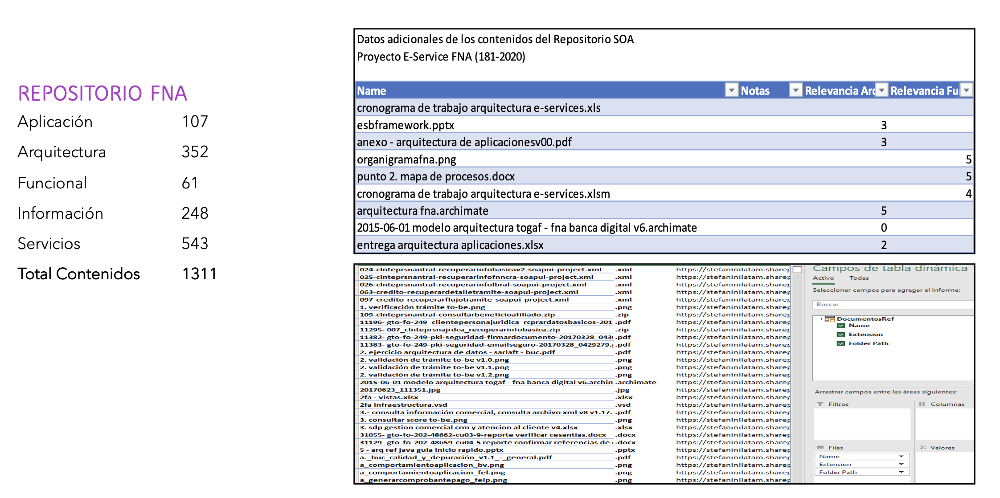

title: E-Service Etapa 2. Arquitectura de Referencia SOA 2.0 del FNA
geometry:
  - top=1in
  - bottom=1in
fignos-cleveref: True
fignos-plus-name: Fig.
fignos-caption-name: Imagen
tablenos-caption-name: Tabla
...

<small><em>Los productos de esta etapa ([Web](https://hwong23.github.io/fna-dd-f2-pry2-e3/v/7b31ac87e48263f74761dc8778a8138aebf85986/))
están basados en el resultado de la consultoría "Arquitectura E-Service",
[Sharepoint STEF@7b31ac8](https://stefaninilatam.sharepoint.com/:f:/r/sites/PROYECTOARQUITECTURAE-SERVICEFNA/Documentos%20compartidos/General/Repositorio%20SOA/Procesos%20Fase%20II/181-2020.%20E-SERV.%20Fase%202-ETAPA%200.%20docx?csf=1&web=1&e=BiNcBP)
del August 10, 2023.
</em></small>

|    **Versión** del producto 1.7b31ac8 de 10 Aug 2023

 

## Autores

+ **Harry Wong, ing.**
   
    · {.inline_icon width=16 height=16}
    [e_hwong](https://github.com/e_hwong)
     
  <small>
     Arquitecto SOA, Stefanini
  </small>

+ **Wilson Morales, ing.**
   
    · {.inline_icon width=16 height=16}
    [wmorales](https://github.com/wmorales)
     
  <small>
     Software, Aplicaciones
  </small>

+ **Sergio Andrés Castro Hernandez, ing.**
   
    · {.inline_icon width=16 height=16}
    [fhernandez](https://github.com/fhernandez)
     
  <small>
     SOA, Arquitectura
  </small>

+ **Viviana M. Martinez, ing.**
   
    · {.inline_icon width=16 height=16}
    [vmmartinez](https://github.com/vmmartinez)
     
  <small>
     Analista, Proyectos
  </small>

::: {#correspondence}
✉ — Enviar mensajes a Harry Wong, ing. \<e_hwong@stefanini.com\>.

:::

 

## Objetivo del Documento
Entrega de los productos de la Etapa 2, PR11 y PR12, del proyecto PR02, Arquitectura de Referencia SOA 2.0 del FNA, flujos de trabajo y personas que ejercitan y conforman (cumplen) con el gobierno SOA del FNA a desplegar a cargo de la oficina de arquitectura.

##  Control de Cambios {.page_break_before}
| Tema           | PRY02 Arquitectura de Referencia SOA 2.0 del FNA      |
|----------------|----------------------------|
| Palabras clave | SOA, E-Service, FNA, Análisis de brecha, GAP, Comparativa              |
| Autor          |                            |
| Fuente         |                            |
| Versión        | 1.7b31ac8 del 10 Aug 2023 |
| Vínculos       | [N003a Vista Segmento SOA FNA](N03a%a20Vsta%20aSegenta%20SOA%20FNA.md) |

 

 

## Contenidos
\toc

---
pr14nombre: "Administración de las transiciones hacia la arquitectura versión 2.0"
...

\newpage

>    E-Service. Fase II
>
>    PRY02. Arquitectura de Referencia SOA 2.0 del FNA. Contenido de los Productos Contractuales
>
>    Contrato 1812020
>
>    FNA, Stefanini
>
>    10 Aug 2023
>
>    **Versión** 1.7b31ac8

 

# Producto 15: PR15. Inventario de artefactos genéricos y concretos de aceleración de implementación
Recogemos en este producto el concepto del _bloque de construcción abstracto_ (ABB, por su siglas en inglés) promovido por TOGAF, y que a su vez podemos hallar su raíz en el concepto del plantilla de tipos o tipos de datos genéricos proveniente del paradigma orientado a objetos. En este producto trataremos de los bloques de construcción genéricos del FNA necesarios para normalizar la elaboración de diseños de solución y transición (dicha elaboración actual los cuales no son del alcance de este producto, ni del proyecto actual).

**Nota**: los análisis de este producto están dirigidos a cumplir los objetivos del proyecto PRY01, Gobierno SOA: desarrollo, gestión, gobierno de arquitectura y adopción.

 

## Justificación
Los bloques de construcción abstractos, o genéricos en este contexto, son diseños previamente validados que pueden ser utilizados directamente en los procesos de elaboración de arquitecturas de solución y de transición en las que la arquitectura de referencia esté involucrada. Estos prediseños son importantes por razones de la aceleración que le aportan a la elaboración de estas transiciones, pero también por la normalización y reutilización que suponen en esto mismo, y porque están directamente asociados con una forma de solucionar el problema del tiempo de mercado diagnosticado en Fase I de esta consultoría.

## Contenidos
1. Definición de los Bloques de Construcción Abstractos del FNA (BCAF)
1. Métodos para la gestión y evolución de los Bloques de Construcción Abstractos del FNA (BCAF)
1. Listado de Bloques de Construcción Abstractos del FNA (BCAF)
1. Utilización de los Bloques de Construcción Abstractos en el FNA

 

## Criterios de Aceptación
* Entendimiento del concepto del bloque de construcción genérico
* Entendimiento del uso de los prediseños de arquitectura 
* Entrega del listado de Bloques de Construcción Abstractos del FNA (BCAF)Lista de 

 

## Modelo de Implementación del PRY02
{#fig: width=}

_Fuente: Elaboración propia._

 

---
prnombre: "Inventario de artefactos genéricos y concretos de aceleración de implementación"
...

\newpage

| Tema           | Administración de las transiciones hacia la arquitectura versión 2.0: **Definición de los Bloques de Construcción Abstractos del FNA (BCAF)** |
|----------------|----------------------------------------------------------------------|
| Palabras clave | SOA, Arquitectura de referencia, Bloques de construcción, Genéricos, Reutilización, Tiempo de mercado                    |
| Autor          |                                                              |
| Fuente         |                                                              |
| Versión        | **1.7b31ac8** del 10 Aug 2023                       |
| Vínculos       | [Ejecución Plan de Trabajo SOA](onenote:#N001d.sharepoint.com); [Procesos de Negocio FNA](onenote:#N003a.com)|

 

# La Problemática del Tiempo de Mercado (salidas a producción) en el FNA
Con base a los diagnósticos de población del portafolio de servicios SOA del FNA (ver @eservices1-22), el cual trata de la clasificación de servicios, tenemos el hecho de que la _mayor cantidad de servicios del portafolio son del tipo servicios de información_ (ver [Anexo 2. Población de servicios del portafolio FNA]). 

Lo anterior significa que la mayor cantidad de servicios SOA que son relevantes para el Fondo Nacional existen para únicamente para propósitos de transporte de información. Esto es, sirven para responder a solicitudes de información que los procesos o aplicaciones se hacen entre ellos. Esta característica de la población del portafolio de servicios se vuelva una situación desfavorable para los cambios de negocio que se ven afectados por el esfuerzo en mantenimiento y gobierno SOA que consumen aquellos otros servicios en detrimento de los servicios de negocio. 

    Los servicios de negocio, aquellos que elaboran una respuesta mediante un cómputo (sea cálculo, diferencia, comparación...), y por tanto, los que inciden en la flexibilidad de negocio, son los de menor presencia en el portafolio FNA.

El esfuerzo que toman los cambios en los servicios de transporte de información debe estar influyendo en inclinar los tiempos hacia el mantenimiento de servicios de información en lugar de a la velocidad de salida (tiempo de mercado) de las funcionalidades de negocio.

Esto último es lo que determina la problemática de la demora en el tiempo de mercado/salida a producción del FNA

## Propuesta de Flexibilidad y Mejora del Tiempo de Mercado del FNA

# Definición de los Bloques de Construcción Abstractos del FNA (BCAF)

## Bloques de Construcción Requeridos por Arquitectura (LAOF)
Los bloques de solución a los que nos referimos en los pasos no. 2 y 5 del flujo anterior, arquitecto de solución, son los paquetes de funcionalidad definidos por las necesidades de negocio o del arquitecto. Pueden ser cualquier clasificador (objeto tipo) correspondiente al modelo de contenidos de la empresa, como por ejemplo, actores, servicios, aplicaciones, o entidades de datos. Representan un único concepto que tiene límites claros y es reconocible como 'parte' en un dominio de la arquitectura. Puede o no interoperar con otros bloques. Es importante que un bloque de construcción tenga una implementación y un uso. Debe además evolucionar mediante la tecnología. 

Los bloques de solución pueden estar compuesto por otros (ensamblado), y por tanto, puede ser descompuesto (desensamblado) en los bloques pequeños que los constituyen. Es obligatorio que sea reutilizable, reemplazable, y especificado a conformidad.

Los sistemas y herramientas de software de la arquitectura del FNA deben estar creados a partir de colecciones de bloques de solución. De ahí que estos bloques deban tener una interfaz de interacción clara y estable para con otros bloques. 

Lo más importante de estos bloques es que son los que contienen los niveles de detalle (100 al 500). Por ejemplo, a nivel 100, el arquitecto del FNA podría dar comienzo al modelado de un bloque de solución mediante un nombre, una descripción o un esquema. Luego, el arquitecto de solución, puede descomponer este mismo bloque en múltiples construcciones acompañada de una especificación más detallada (nivel 200 al 500).

En la siguiente imagen ilustramos esta variante del flujo de trabajo de la oficina de arquitectura del FNA.

{#fig:flujoADM-2.png width=}

_Fuente: Elaboración propia._

 

El flujo 2, que atiende la colaboración entre oficinas de arquitecturas, bien puede ser iniciado por un flujo interno de la oficina del FNA, (FLUJ01, Flujo de Trabajo Oficina de Arquitectura Interno). Es frecuente que una implementación iniciada por el este flujo (2 le corresponda una revisión interna, y de esta, se inicien varios flujos de implementación y colaboración de cambios a los servicios y aplicaciones del FNA.

 

## Anexo 2. Población de servicios del portafolio FNA
La tabla siguiente muestra la población de servicios del portafolio FNA.

|                      |              |
|----------------------|--------------|
| **Tipo Servicio**    | **Cantidad** |
| Servicio Información | **55**       |
| Servicio Proceso     | 18           |
| Servicio Negocio     | 14           |
| **Total general**    | **87**       |

[Tabla.]() Catalogación de los tipos de servicios SOA del FNA.

_Fuente: elaboración propia, FNA_PortafolioServiciosFinal+ConsumidoresyProveedores.xlsx_

Los servicios de negocio, aquellos que elaboran una respuesta mediante un cómputo (sea cálculo, diferencia, comparación...), y por tanto, los que inciden en la flexibilidad de negocio, son los de menor presencia en el portafolio FNA.

 

---
prnombre: "Análisis de impacto y modelos actualizados de los ítems de arquitectura"
...

\newpage

>    E-Service. Fase II
>
>    PRY02. Arquitectura de Referencia SOA 2.0 del FNA. Contenido de los Productos Contractuales
>
>    Contrato 1812020
>
>    FNA, Stefanini
>
>    10 Aug 2023
>
>    **Versión** 1.7b31ac8

 

# Producto 16: PR16. Análisis de impacto y modelos actualizados de los ítems de arquitectura
Similar al ejercicio del producto 6, Modelos actualizados de los ítems de arquitectura impactados (PR06), del proyecto PRY01 de esta misma consultoría, en este producto hacemos lo propio respecto de los modelos de la arquitectura de referencia 2.0 del FNA. Por tanto, en este producto organizamos y consolidamos en el depósito de arquitectura del FNA (propuesto por esta misma consultoría) la información de los modelos de la arquitectura de referencia SOA 2.0 del FNA. A este lo complementa el análisis de impacto inicial que trate sobre las implicaciones de la adopción de los cambios funcionales y tecnológicos enunciados por esta arquitectura camino a ser el mapa de viaje de la transformación de las capacidades de negocio y de arquitectura del FNA (ver [Producto 11](<../../fna-dd-f2-pry2-e1/content/11.detalle roles recursos.md>) de este proyecto).

Al repositorio línea base entregado por el proyecto 1 (anterior a este) agregamos nuevos modelos a razón de la  arquitectura de referencia y del ejercicio de este producto.

| Tipo de Entrada      |          |
|----------------------|---------:|
| Arquitectura         | 12       |
| Funcional            | 4        |
| **Total Contenidos** | **1311** |

**Nota**: los análisis de este producto están dirigidos a cumplir los objetivos del proyecto PRY01, Gobierno SOA: desarrollo, gestión, gobierno de arquitectura y adopción.

 

## Justificación
Uno de los objetivos nominales, y objeto del proyecto actual, es la creación de la primera versión de la arquitectura de referencia SOA del FNA proyecto. Objetivo que se pliega al de _aumentar la relevancia de los modelos de arquitectura del Fondo Nacional_. En este proyecto 2 de Fase, II E-Service, los modelos son instrumentos de encuentro para el entendimiento, análisis, y comunicación entre actores, como ingenieros, arquitectos, proveedores, líderes de grupo. Se cumple también la máxima de proyectos anteriores de esta misma consultoría: los modelos, en este caso de la arquitectura de referencia, son por el sujeto principal, y la evidencia, de la existencia del gobierno. Por estas razones es que los modelos de referencia SOA 2.0 creados aquí tienen la importancia tal para ser entregados en contribución al repositorio de arquitectura de la empresa.

## Contenidos
1. Definición de los Bloques de Construcción Abstractos del FNA (BCAF)
1. Métodos para la gestión y evolución de los Bloques de Construcción Abstractos del FNA (BCAF)
1. Listado de Bloques de Construcción Abstractos del FNA (BCAF)
1. Utilización de los Bloques de Construcción Abstractos en el FNA

 

## Criterios de Aceptación
1. Detalle de ítems de la línea base de arquitectura de referencia 2.0 del FNA
1. Repositorio de arquitectura del FNA, versión 0.5, actualizado con arquitectura de referencia
1. Consideraciones para la adopción y puesta en marcha de los cambios en las arquitecturas del FNA
1. Anexo. Herramienta de navegación del repositorio de arquitectura del FNA versión 0.3

 

## Repositorio de Arquitectura del FNA, versión 0.5
{#fig: width=}

_Fuente: Diagnóstico SOA. E-Service (2022)._

## Modelo de Implementación del PRY02
{#fig: width=}

_Fuente: Elaboración propia._

 

\newpage

# Referencias {.page_break_before}
<!-- Explicitly insert bibliography here -->

@eservices1-22 @eservices3-22 @eservices4-22 @eservices5-23 @eservices6-12 @eservices7-23 @bptrends07

